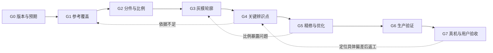

# 从 RX-78 到可复用模型制作流程

2026-09-13。目标为 **2015 HGUC #191 RX-78-2 Revive**，分支 `feat/gundam-museum`。用户在 R5 烧录体验后反馈：“基本满足要求了”。本记录归纳实际经过，通用执行规则只有一份，见 [分节点 Pipeline](../skills/reference-model-workshop/references/pipeline.md)。

## 这次实际怎么做到的

1. **打通展示原型（R1）**：用 Mini 4WD 的生产软件光栅器，把 RX-78 拆成可编辑 C++ 部件，接入博物馆全身、头部特写和旋转查看。技术链路能跑，但外形过于概括；用户明确指出“完全不像”。问题是把技术可运行误当成造型已成立。
2. **锁版本、用成品多图重建整体（R2–R3）**：锁定 HGUC 191 Revive，查看官方说明书与三张成品图，补两个动作来检查站姿被遮住的结构。重做头身关系、胸部 U 形颈圈、裙甲、小腿曲线、装备和脚底。灰模与原生图都通过同一生产资产生成，开始保留固定相机的前后对照。
3. **看板件，纠正装配理解（R4）**：查看 A/B/C 板件和头、躯干、手臂、腿、武器拆件，对照官方编号。修正肩甲平面及倒角、长胫骨甲、U 形踝甲与关节、真实凹槽；同时发现并修复悬空连接和深度闪烁。板件提供结构证据，没有提供精确三维尺寸，也没有直接变成游戏网格。
4. **单独校准脸部（R5）**：用户指出“面部比例还是不对”。补同款正脸、侧前方、面罩内件近照，隔离头部并去掉身体倾斜。把面罩／眼跨度／下巴宽分别用头壳宽归一化，修正宽高比例和眉檐、眼窝、面罩的前后关系。最后再修眉心与眼间黑区，回看全身和原生特写。
5. **验证渲染与减负（贯穿后期）**：在同源模型上检查有限坐标、容量、遮挡、背面剔除、埋藏面省略和局部重画。省掉已验证不可见的 32 个端盖；曾删头壳顶盖出现像素差，恢复而不是放宽检查。精修使面数上升，并非“越做越少面”。
6. **烧录和实际观看**：R5 模型提交 `1dfa778`，实际构建标识 `1dfa778-dirty`，烧录写入哈希校验通过，观察到 PSRAM 检查和主菜单启动。用户随后给出上述基本认可，形成首次明确的真机视觉接受记录。

R1–R5 的编号是实际迭代历史，**下次不应重复五轮被动返工**。关键改进是把板件研究、灰模门禁和关键部位特写提前，让错误在增加细节前暴露。

## 下次固定走的 8 个节点

图示回路是常见示例；实际退回最早受影响节点。每个节点都留输入、产物、实际看过的画面、通过依据和返工点，完整细则见 [Pipeline](../skills/reference-model-workshop/references/pipeline.md)。制作工作副本使用 [模型卡](../skills/reference-model-workshop/assets/model-card.md)。

- **形体先过关**：先整体灰模，再局部辨识点；头脸不对时不以身体细节补偿。
- **参考分工明确**：成品看外观、板件看分件、说明书校编号、近照看局部。缺失部分写估计，不混用不同版本凑模型。
- **对比可复查**：同相机看旧版和新版；参考配准记录裁剪和等比缩放。实际打开看图，不用图片存在、哈希变化或测试数量证明“像”。
- **减负有证据**：只删在约定展示／姿态范围里验证不可见的几何；保留可见开口、内壁、连接和辨识点。
- **技术与外观分开验收**：构建、回归、设备启动、设备性能、用户视觉反馈是不同结论。内部检查自主推进，最终认可记录用户原话。

## RX-78 最终记录

R5 装备模型 4,045 panels；补回端盖 4,077，小于 4,096 容量；工作区 710,712 B。主机 ASan／UBSan 下 2,592 组渲染组合通过，埋藏面补回和局部重画均为 0 像素差异。主机证据含 10 张原生画面、21 张结构图和 48 帧巡展。

用户接受范围是此次 RX-78 展示效果“基本满足要求”，不扩大为全部官方角度的精确复刻或量化性能达标。帧率与设备剩余内存未实测。实际烧录的 3,947,600 B 固件包含已有工作区修改，不能只凭 `1dfa778` 重现整个固件；R5 模型源文件一致性已核对。

实际烧录哈希：`fbef162659b9642bd6f6472b653767ce9c61e25c1e61877cec60f4dae0b40287`。原烧录观察记录和此次用户反馈分别保存于 [设备验收记录](assets/gundam-rx78-v5/device-acceptance.json)，不覆盖原 `firmware.json` 的预烧录记录。

历史依据：[R1 制作卡](Gundam-Museum-RX78-R1-模型制作卡.md)、[R2 视觉复核](Gundam-Museum-RX78-R2-视觉复核.md)、[R3 官方多图](Gundam-Museum-RX78-R3-官方多图校准.md)、[R4 板件核对](Gundam-Museum-RX78-R4-板件核对与精修.md)、[R5 面部比例](Gundam-Museum-RX78-R5-面部比例校准.md)。

## 下次如何启动

在本仓库直接说：**“按模型 Pipeline 制作〈模型名／具体版本〉，用于〈展示场景〉。”** 仓库 `AGENTS.md` 已指向 [Reference Model Workshop](../skills/reference-model-workshop/SKILL.md)，后续模型任务会加载这套方法。没有版本时先核对版本；没有特别要求时沿用项目展示通路并记录假设。

其他项目可读取或迁移该技能目录，通用方法继续适用；坐标、建模工具、测试矩阵和预算需按项目重新配置。[高达适配页](../skills/reference-model-workshop/references/gundam.md) 明确标出了当前工具的 RX-78 专用部分。目前沉淀的是可执行工作流程与现有验证工具，并非输入任意名称即可自动产出合格网格的生成器。
