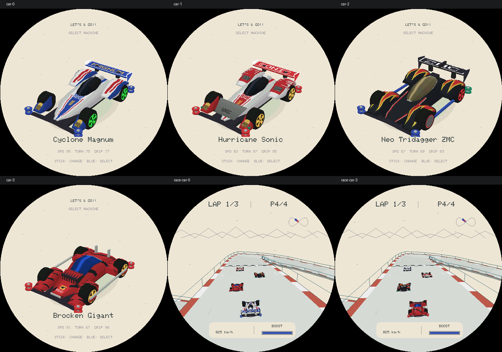
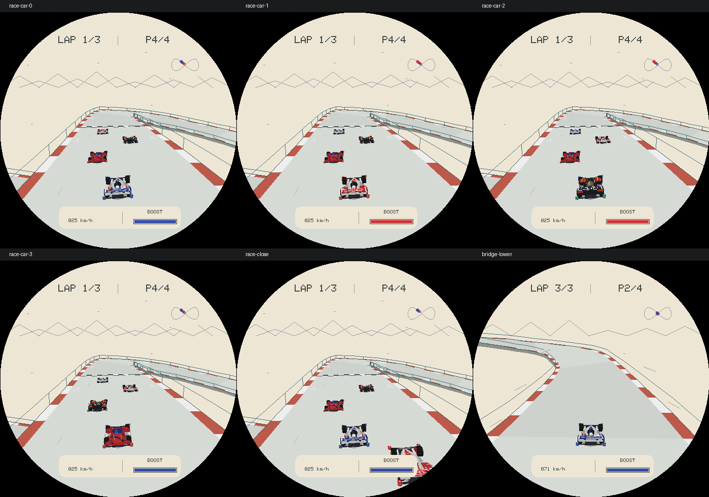

# R16：实体赛车与比赛细化

## 结果与边界

按本轮“尽量精细，比赛中也是，可以放弃 wireframe”的要求，车库和比赛一起改用实体曲面网格、材质贴花、透视 UV 和逐像素深度遮挡。车库不再描边，比赛不再使用百余条线的简化车架；低档只减少曲面采样。

这是参照官方实物照片手工重建的模型，不是官方 CAD、扫描模型或完整原版贴纸复刻。轮廓与材质仍是适配 466×466 手表画面的近似；主机截图不等同于真机帧率或显示效果。





[修改前画面](assets/lets-and-go-r16-before.png)。以上图片均由实际 C++ 生产渲染器输出，经现有工具拼接，不是概念效果图。

## 参照与方案

通过 browser 技能重新逐张查看田宫官方产品照片，核对轮罩、轮距、座舱、尾翼与颜色关系：

- [Cyclone Magnum / 19440](https://www.tamiya.com/english/products/19440/index.html)：蓝白车鼻、绿色宽五叶轮毂、小型前轮罩、红色后轮罩纹样与高侧板尾翼。
- [Hurricane Sonic / 19441](https://www.tamiya.com/english/products/19441/index.html)：红白外壳、灰黑前连接翼、青绿点缀、黄色轮毂与后轮罩格栅。
- [Neo Tridagger ZMC / 19409](https://www.tamiya.com/japan/products/19409/index.html)：深色宽车头、铜色座舱、轮罩火焰、不同前后轮毂与 ZMC 尾翼。
- [Brocken Gigant / 19452](https://www.tamiya.com/japan/products/19452/index.html)：宽厚红黑壳、贴合车壳的蓝色风挡、前部散热肋、银色侧杆、金色轮毂和短尾鳍。

比较过多角度预渲染图片和实时实体两条路线。本轮采用后者，保留转向、侧滑、上下坡时的连续视角，不引入离散角度切换与图集。未购买、下载或导入第三方模型，也未嵌入产品照片。性能取舍仍以真机测试为准。

## 实现

- 四车分别定义截面和部件曲线，插值细分圆润车壳与座舱；不是给同一壳体换色。
- 轮胎包含胎面、倒角、内外侧壁；轮毂使用宽叶片，保持轮胎包络不变，只旋转轮毂。
- 字样、火焰、虎纹、车窗高光等由 UV 材质采样，直接贴合曲面，不用悬浮面片模拟贴纸。
- 车库与比赛共享建模代码和材质。车库采用高档曲面，比赛默认中档实体网格，低档仍保留车壳和涂装。
- 逐像素逆深度解决自身前后遮挡，先做相机近裁剪，再进行透视正确的 UV 插值。立交道路深度继续参与车辆可见性判断。
- 近距离赛车采用多块 112×112 缓存完整覆盖投影范围，避免放大后出现方形截断。
- 追尾镜头拉近并抬高画面中的玩家车，避免与底部 HUD 重叠；不改变车体物理尺寸、赛道、碰撞或比赛逻辑。增加轻量接地阴影。

## 两轮自审与修正

### 第一轮：车型和曲面

- 修正前鼻宽度、前后轮罩衔接、座舱曲率，以及过细而近似线框的轮毂叶片。
- Brocken 的独立风挡曾被主壳盖住，改为在弯曲壳体上直接采样蓝色玻璃材质。
- Sonic 前连接翼误用红色尾翼材质，改为灰黑材质与小字样。
- Neo 去掉整片车头的重复火焰，分离前轮深色轮盖与后轮红色结构。
- Brocken 高档散热肋过度细分造成面数超限，改为肋片局部单步构建，并加容量门禁。

### 第二轮：显示、边界与资源

- 修正尾翼文字 UV 的上下颠倒。
- 栅格包围盒先夹到缓存范围再转整数；加入近面穿越、随机三角形、逆深度与 UV 分块一致性回归。
- 修正大车单块缓存截断；增加四款玩家车比赛截图与近距离对手截图，不只检查选车页。
- 调整追尾相机主点，使放大的玩家车保持在 HUD 上方；检查桥段遮挡和接地阴影。
- 大曲面/深度缓存从常驻实例移到进入游戏分配、退出释放，处理初始化分配失败；加入反复打开/关闭测试。每帧不动态申请这些缓存。

## 预算

| 车型 | 车库 High 面数 | 比赛默认 Medium | 比赛 Low |
| --- | ---: | ---: | ---: |
| Magnum | 1645 | 1221 | 797 |
| Sonic | 1758 | 1318 | 878 |
| Neo Tridagger | 1590 | 1182 | 774 |
| Brocken | 1824 | 1416 | 1008 |

车库容量 2048 面，单款比赛容量 1536 面，均有有界构建与溢出测试。桌面布局测得：

- 车库实例 3,000 bytes；打开期模型和 352×288 颜色/深度缓存 528,408 bytes。
- 比赛实例 39,352 bytes；四车模型和 112×112 颜色/深度缓存 418,864 bytes。
- 打开期合计 947,272 bytes，约 925 KiB；实例合计 42,352 bytes。

项目配置启用 PSRAM malloc，超过 16 KiB 的大分配可使用 PSRAM；上述数字不保证设备当时有足够连续内存，也不证明实时性能达标。必须验收四车桥下、近距离分块、车库 High 的帧耗时、内存余量与退出回收。

## 验证结果

- `SANITIZE=1 bash tools/test_lets_and_go.sh`：全部 28 套通过（12 套游戏、15 套 Vector Run、1 套 Launcher），ASan/UBSan 无报错。
- 保留 384 场策略比赛、64 场耐久情景和 8000 次道路裁剪回归；生产道路检查 144 个全程/细节视角，本次最大遮挡面数 242。
- 新增实体深度顺序、桥面遮挡、近裁剪、透视 UV 分块一致性、1000 个随机三角形、四车比赛和缓存反复开关测试。
- `idf.py build` 成功。固件大小 `0x49f0b0`，最小应用分区 `0x4f0000`，剩余 `0x50f50`（6%）。
- 未连接硬件，未烧录，未推送或公开发布。30 FPS 仍是目标，不是本轮实测结果。

复现画面：

```sh
bash tools/render_lets_and_go.sh /tmp/lets-go-r16-review
python3 tools/lets_and_go_contact_sheet.py /tmp/lets-go-r16-review /tmp/lets-go-r16-review/cars.png --names car-0 car-1 car-2 car-3 race-car-0 race-car-3
python3 tools/lets_and_go_contact_sheet.py /tmp/lets-go-r16-review /tmp/lets-go-r16-review/race.png --names race-car-0 race-car-1 race-car-2 race-car-3 race-close bridge-lower
```
