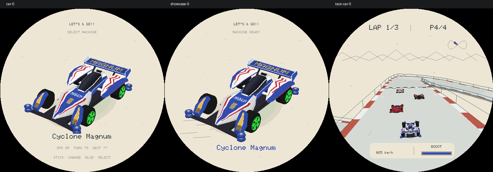
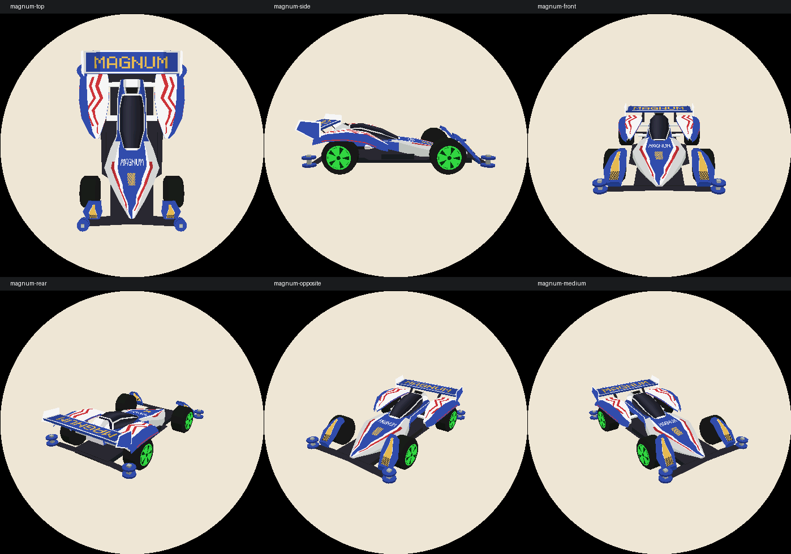

# R17：Cyclone Magnum 腰线与结构复核

## 本轮范围

只重建第一辆 Cyclone Magnum 的关键结构。R16 的实体渲染方案保留，但不再让 Magnum 与 Sonic 共用中央壳体。其他三车没有重做；三个选车页面与 R16 的主机像素文件逐字节一致。比赛统一修正模型坐标转换，因此各车的非对称涂装方向会随之纠正，不改变车辆位置、转向或碰撞。

这是参照照片的手工近似模型，不是官方 CAD 或尺寸扫描；结构测试验证本轮定义的几何约束，不代表已证明所有细节与实物完全一致。

## 参考与发现

使用 browser 技能查看 [田宫 19440 官方实物照片](https://d7z22c0gz59ng.cloudfront.net/japan_contents/img/usr/item/1/19440/19440_1.jpg) 和 [Hobby Search 的裸车壳展示照片](https://www.1999.co.jp/itbig29/10290134b3.jpg)，后者用于分辨被贴纸掩盖的折面、镂空与连接位置。[官方产品页](https://www.tamiya.com/english/products/19440/index.html) 对应 Cyclone Magnum Premium / AR 底盘版本。

R16 将中央外壳建成逐渐收尖的圆拱，在座舱旁仍有约 0.28 的半宽；它与后轮罩相互覆盖，把腰部通道填成实体。继续细分这个圆拱不会修复轮廓。新模型使用独立的硬折面截面：前肩展开、座舱两侧明显收窄，独立后轮罩通过短连接件与中央车体连接。

## 修改

- **腰线和车鼻**：重做宽肩、折面、窄腰与尖鼻的过渡。前肩半宽 0.305、座舱中部中央壳半宽 0.16；这些是模型单位下的设计值，不是从照片声称测得的毫米尺寸。
- **腰部开口**：中央车壳与后轮罩之间保留真实空间，仅在两处以短连接件连接，下方底盘托盘独立建模。
- **座舱**：从椭圆泡罩改为向前倾斜的硬边风挡，补白色侧框、后部隆起进气口和黑色开口。
- **后轮罩**：重做内外边界、折脊、宽后端与收窄前端；薄壳下沿不再一直封到轮胎内部。
- **前轮罩**：采用前倾独立蓝色罩片和落在保险杠上的支脚，校正表面和下沿相对胎面的间隙。
- **尾翼和轮毂**：改为有弯度的翼面、倾斜支架、后掠侧板；Magnum 单独使用更宽的五叶轮毂。
- **材质**：蓝色车鼻区域、侧面分色、左右镜像红色折纹分别映射到对应部件，避免一侧轮罩外侧蓝色却出现在另一侧内壁。



[修改前的相同场景](assets/lets-and-go-r17-before.png)。以下是同一生产网格、材质与栅格器的检查视角，不是概念图或新增游戏页面：



## 第一轮自检与修复：结构

1. 检查俯视与侧视，确认宽车鼻与窄腰分离，座舱到后轮罩之间不再被中央车壳封住。
2. 给面片增加部件标签，复用原本保留的一个字节，不增加缓存占用。按车鼻、座舱、前后轮罩、连接件、进气口、尾翼等分别验收。
3. 新增轮罩/车鼻与轮胎包络的相交采样：每个三角形检查 66 个点，覆盖边界与内部。首轮在每档发现 52 个超容差采样点，最深约 0.0152 模型单位，位于前轮罩外侧下沿。
4. 将前轮罩外折边从 0.042 改为 0.012 厚度，并补保险杠支脚。三档均不再出现超过 0.003 容差的相交采样点。此为有限采样检验，不宣称解析证明完全无相交。
5. 收整后轮罩外轮廓和后端宽度，取消其过圆、过度收尖的形态。

## 第二轮自检与修复：显示与回归

1. 俯视检查发现文字镜像，追查到模型的 x 方向沿用车库正视坐标，而比赛/look-at 使用车辆右侧坐标。增加统一转换 `carPointInTrackBasis`，在进入比赛/检查相机前转换；车库原画面不变。不是翻转截图或改玩家转向。
2. 对左右轮罩逐面检查镜像几何与 UV 一致性，并在 Low/Medium/High 重复验证腰部开口、座舱斜度、宽肩与窄腰、左右高度和轮胎间隙。
3. 检查正面、侧面、俯视、后方、两侧斜视、中低档，以及选车、放大和实际比赛截图。生成器保留全部检查图，避免只看一个展示角度。
4. 清除 Magnum/Sonic 共用壳体的旧条件分支；Sonic 仍保留原几何，其他三车选车像素与本轮修改前一致。
5. 完整回归、内存安全检查和固件构建后再提交。

## 验证与预算

- `SANITIZE=1 bash tools/test_lets_and_go.sh`：28 套回归通过，ASan/UBSan 无报错，包括新增结构检查，以及原有比赛、道路/桥面遮挡、近裁剪和生命周期回归。
- Magnum 面数：High **1192**、比赛默认 Medium **976**、Low **760**，均在原容量内。结构更准确依靠独立折面与部件拓扑，不以盲目增加面数作为精度指标。
- 车库/比赛实例合计仍为 42,352 bytes，打开期曲面缓存仍为 947,272 bytes；不增加每帧动态分配。
- `idf.py build` 成功，固件大小 `0x4a0810`，最小应用分区 `0x4f0000`，剩余 `0x4f7f0`（6%）。没有更新项目依赖。
- 本轮无硬件，未烧录、未推送、未公开发布。真机 FPS、PSRAM 余量和 AMOLED 显示仍待验收。

复验：

```sh
SANITIZE=1 bash tools/test_lets_and_go.sh
bash tools/render_lets_and_go.sh /tmp/lets-go-r17-review
python3 tools/lets_and_go_contact_sheet.py /tmp/lets-go-r17-review /tmp/lets-go-r17-review/structure.png --names magnum-top magnum-side magnum-front magnum-rear magnum-opposite magnum-medium
```
