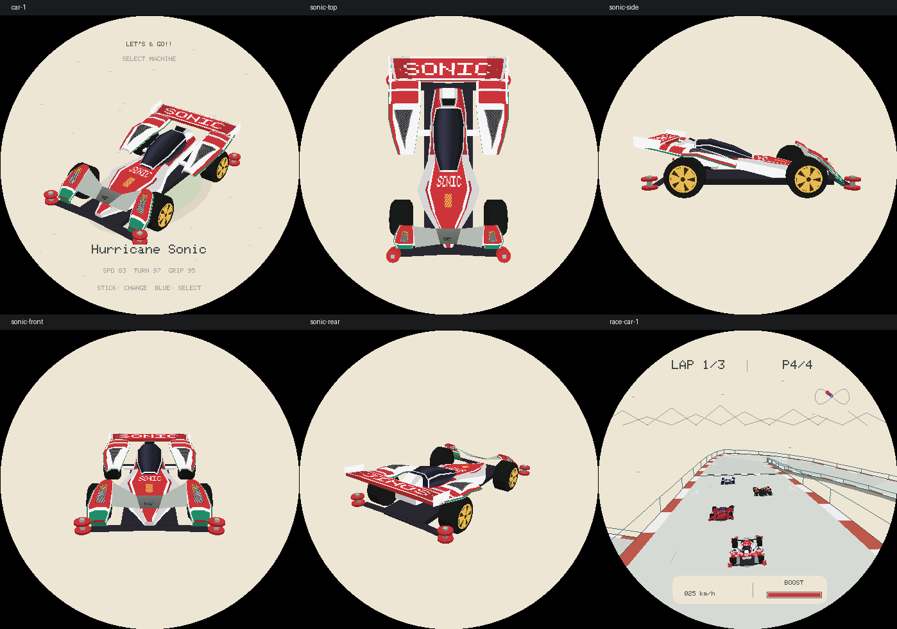

# R18：其余三车结构复核

按 R17 的流程分别处理 Sonic、Neo Tridagger 和 Brocken：实物/可用裸壳参考、独立结构、三档几何检查、多视角及比赛截图、两轮自检与阶段提交。Magnum 保留 R17 结构。本文件随各车完成更新，不将未完成阶段记作通过。

所有模型都是手工重建的近似，不是官方 CAD、扫描资产或完整原版贴纸。生产 C++ 截图验证的是模型和显示逻辑，不证明真机帧率。无硬件、不烧录、不推送、不公开发布。

## 阶段 A：Hurricane Sonic（完成）

参考：[田宫 19441 实物](https://d7z22c0gz59ng.cloudfront.net/japan_contents/img/usr/item/1/19441/19441_1.jpg)、[裸车壳与贴纸展示](https://www.rcjaz.com/images/tamiya/mini_4wd_series/mini_4wd_car_kit/ar_chassis/b_19441_SUB_3.jpg)。使用 browser 技能逐张查看，区分车壳轮廓与贴纸色块。

- 重做宽肩/窄腰和斜面座舱；后轮罩与中央车体之间留开口。
- 前翼由横跨两轮的平板改为两侧抬起、中央下凹的连接翼，前轮罩有薄壳和落地支脚。
- 后轮罩通过渐升翼面连接到尾翼，并保留三道横向台阶条；不是圆拱上另架一块平板。
- 补前轮罩青绿色下缘、后侧分色、三角形格栅和更宽的黄色五叶轮毂。

第一轮自检：按俯视、侧视和前视核对独立腰线、前翼凹曲和尾翼连续性，加入部件标签、三档轮胎间隙、左右几何/UV 和开口探针检查。

第二轮自检与修正：发现后翼横条在中部被轮罩盖住，改为沿轮罩截面的薄条；修正过窄的中央红色区域。检查正面、侧面、俯视、后方、两侧斜视及中低档；Magnum 选车截图与修改前逐字节一致。

验证：28 套 ASan/UBSan 回归通过；轮罩/车鼻每三角形 66 点的三档采样均未发现超过 0.003 模型单位容差的穿胎点。High/Medium/Low 面数 1225/1009/793，缓存占用不变。ESP-IDF 固件构建通过后进行阶段提交。



## 阶段 B：Neo Tridagger ZMC

待完成。

## 阶段 C：Brocken Gigant

待完成。

## 复验

```sh
SANITIZE=1 bash tools/test_lets_and_go.sh
bash tools/render_lets_and_go.sh /tmp/lets-go-r18-review
```

生成器现在为全部四车输出 `magnum/sonic/neo/brocken` 前缀的 `top`、`side`、`front`、`rear`、`opposite`、`medium`、`low` 检查图，以及原有选车、展示和比赛截图。
