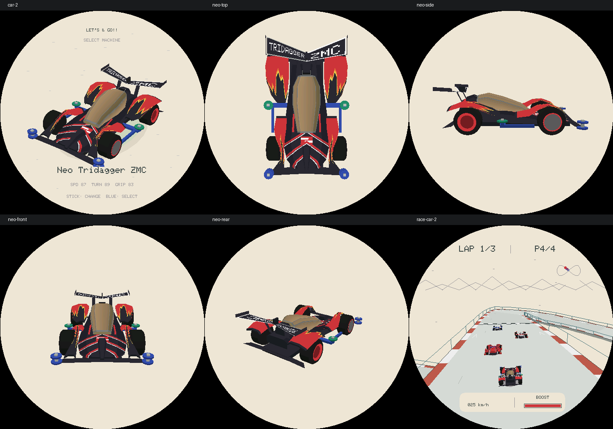
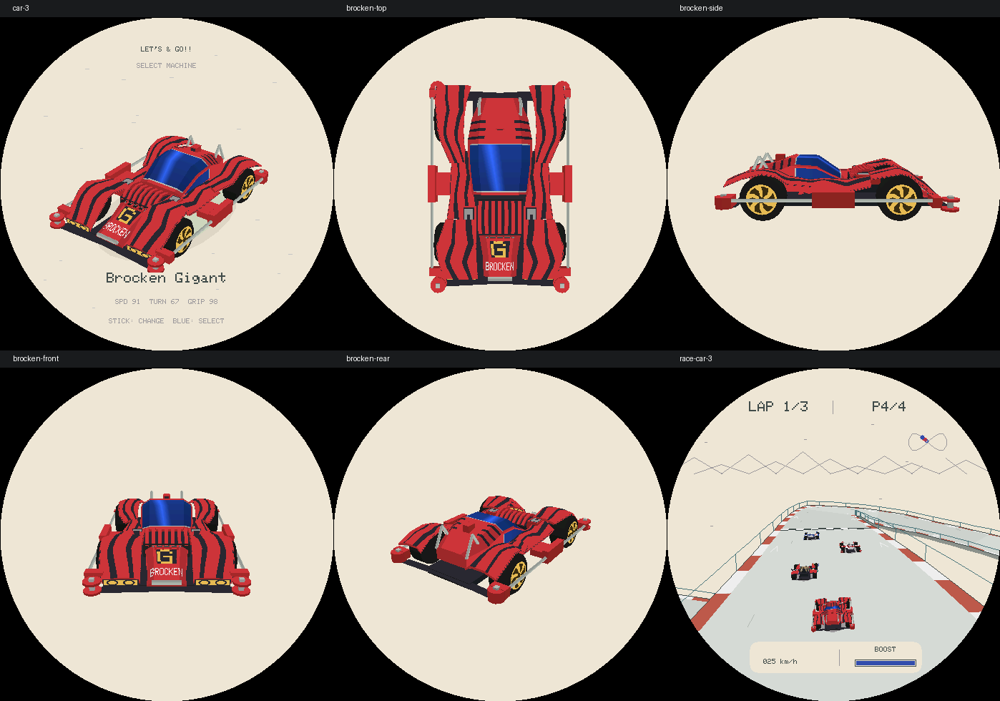
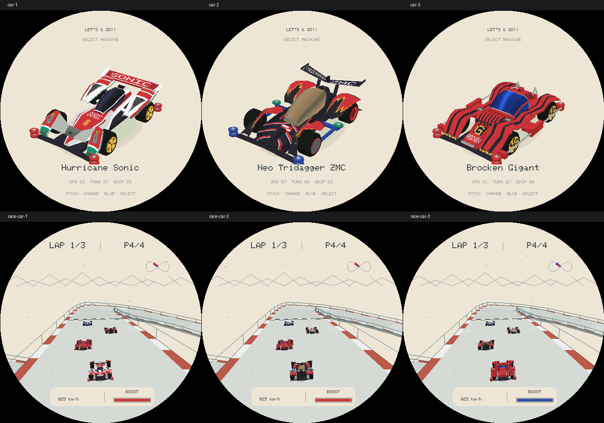

# R18：其余三车结构复核

按 R17 的流程分别完成 Sonic、Neo Tridagger 和 Brocken：实物/可用裸壳参考、独立结构、三档几何检查、多视角及比赛截图、每车两轮自检与阶段提交。Magnum 保留 R17 结构，选车截图与本轮开始前逐字节一致。

所有模型都是手工重建的近似，不是官方 CAD、扫描资产或完整原版贴纸。生产 C++ 截图验证的是模型和显示逻辑，不证明真机帧率。无硬件、不烧录、不推送、不公开发布。

## 阶段 A：Hurricane Sonic（完成）

参考：[田宫 19441 实物](https://d7z22c0gz59ng.cloudfront.net/japan_contents/img/usr/item/1/19441/19441_1.jpg)、[裸车壳与贴纸展示](https://www.rcjaz.com/images/tamiya/mini_4wd_series/mini_4wd_car_kit/ar_chassis/b_19441_SUB_3.jpg)。使用 browser 技能逐张查看，区分车壳轮廓与贴纸色块。

- 重做宽肩/窄腰和斜面座舱；后轮罩与中央车体之间留开口。
- 前翼由横跨两轮的平板改为两侧抬起、中央下凹的连接翼，前轮罩有薄壳和落地支脚。
- 后轮罩通过渐升翼面连接到尾翼，并保留三道横向台阶条；不是圆拱上另架一块平板。
- 补前轮罩青绿色下缘、后侧分色、三角形格栅和更宽的黄色五叶轮毂。

第一轮自检：按俯视、侧视和前视核对独立腰线、前翼凹曲和尾翼连续性，加入部件标签、三档轮胎间隙、左右几何/UV 和开口探针检查。

第二轮自检与修正：发现后翼横条在中部被轮罩盖住，改为沿轮罩截面的薄条；修正过窄的中央红色区域。检查正面、侧面、俯视、后方、两侧斜视及中低档；Magnum 选车截图与修改前逐字节一致。

验证：28 套 ASan/UBSan 回归通过；轮罩/车鼻每三角形 66 点的三档采样均未发现超过 0.003 模型单位容差的穿胎点。High/Medium/Low 面数 1225/1009/793，缓存占用不变。ESP-IDF 固件构建通过后进行阶段提交。


## 阶段 B：Neo Tridagger ZMC（完成）

参考：[田宫 19409 官方实物](https://d7z22c0gz59ng.cloudfront.net/japan_contents/img/usr/item/1/19409/19409_1.jpg)、[官方产品说明](https://www.tamiya.com/japan/products/19409/index.html)。未找到可确认属于同款的清晰裸壳多视角，因此不混用搜索结果中的 Tomica 压铸车或 Carbon Special 配色。

- 重建低平宽车鼻和独立中央尖脊，内收侧导流片，保留前轮的大面积露出。
- 铜色座舱改为有分窗边界、宽前端的硬折面；尾翼改为后掠分叉轮廓和分开的左右文字。
- 前轮保持深色轮盖，后轮改为红色凹盘，不再用通用五叶轮毂；绿色导轮改到车侧蓝色支架，而非尾部保险杠。
- 火焰从重复黄叶状改为不规则红色主体与窄黄色尖端。

第一轮自检：发现前导流片下沿每档 104 个采样点穿入轮胎（最大约 0.0193 模型单位），收回外缘并调整高度后通过；修正仍然过尖的座舱前端、左翼反向文字。

第二轮自检：补中央尖脊高差、前轮罩开口、座舱前端宽度、尾翼后掠空区、侧导轮位置断言，复查全部视角与比赛。火焰改为小型折线采样表，避免逐像素三角函数；将车头数字前移至座舱以外。Magnum/Sonic 选车截图保持不变。

验证：28 套 ASan/UBSan 回归通过；High/Medium/Low 为 1171/955/739 面，缓存不变。ESP-IDF 固件构建通过后阶段提交。几何间隙仍是有限采样、0.003 容差，不声称解析证明。



## 阶段 C：Brocken Gigant（完成）

参考：[田宫 19452 实物](https://d7z22c0gz59ng.cloudfront.net/cms/img/usr/item/1/19452/19452_1.jpg)、[未组装套件照片](https://img.atwiki.jp/mini4vipwiki/attach/821/1073/IMG_4169.JPG)、[官方规格](https://www.tamiya.com/english/products/19452/index.html)。裸壳照片有塑料包装反光，仅辅助确认独立前罩与后壳，细节以官方成品照片为主。轮毂按官方说明改为黄色六辐螺旋式，未混用特殊黑色版本。

- 从连续圆壳改为宽座舱、外露马达区、独立前罩三段结构；补中部侧板与护架的连接。
- 前罩保留钝头、格栅、G 标识和双灯；后轮罩围绕轮胎留空间，不添加高尾翼。
- 管状银色侧护架、红色端块和两根斜置后支架使用真实多面管体，不再用长方体杆替代。
- 六条螺旋轮辐各分两片曲折叶片并保持动画，后导轮改为单层厚轮；前导轮仍为双层。
- 前部马达的七条拱形散热肋独立建模；风挡侧面单独取样，保留红色下框，避免玻璃一直延伸到车底。

第一轮自检与修正：初版轮罩每档发现 72 个超容差穿胎采样点（最大约 0.0120 模型单位）。增加前轮罩沿轮胎弧线的中间截面，随后定位并修正剩余后轮罩 6 个点（约 0.00434）。补中部车壳/侧护架连接，并将护架端块放到轮胎包络以外。

第二轮自检与修正：将 Sonic/Neo/Brocken 的间隙测试扩大到全部已标记车身附件（不将本就位于车轮内的底盘/轮胎本身纳入碰撞判断），因此发现并缩短 Neo 伸入前轮的蓝色侧支架。复查六辐动画、三段主体、管架、低尾部、侧窗下框和灯饰；去掉所有车型已不再使用的通用圆拱壳/平板尾翼构建器。补所有实体顶点必须落在比赛分块渲染包围盒内的门禁，避免细化附件被裁断。

验证：High/Medium/Low 为 1361/1139/917 面；三档体壳与附件间隙通过有限采样测试，容差 0.003 模型单位。28 套 ASan/UBSan 回归和 ESP-IDF 构建通过。最终截图如下。



## 联合验证与最终预算

| 车型 | High | 比赛默认 Medium | Low |
| --- | ---: | ---: | ---: |
| Magnum（R17 保留） | 1192 | 976 | 760 |
| Sonic | 1225 | 1009 | 793 |
| Neo Tridagger | 1171 | 955 | 739 |
| Brocken | 1361 | 1139 | 917 |

每个阶段均完成两轮自检，再运行完整回归和固件构建后提交。Sonic 阶段 `db4fb45`，Neo 阶段 `37a8143`；最终阶段同时包含 Brocken 和联合复验发现的 Neo 侧支架修正。

- 28 套回归包含生产渲染、384 场输入策略、64 场耐久情景、近裁剪与立交遮挡，以及新增三档部件、左右 UV、轮胎间隙和比赛包围盒检查。ASan/UBSan 无报错。
- 车库/比赛实例仍为 3,000/39,352 bytes，打开期缓存仍为 528,408/418,864 bytes；没有增加缓存或每帧动态分配。
- 最终 `idf.py build` 成功，固件 `0x4a2040` bytes，最小应用分区 `0x4f0000`，剩余 `0x4dfc0`（6%）；没有更新依赖。未烧录、未推送，真机帧耗时和内存余量仍待验证。



[修改前相同场景](assets/lets-and-go-r18-before.png) · [三车俯视和侧视](assets/lets-and-go-r18-structures.png)

## 复验

```sh
SANITIZE=1 bash tools/test_lets_and_go.sh
bash tools/render_lets_and_go.sh /tmp/lets-go-r18-review
```

生成器现在为全部四车输出 `magnum/sonic/neo/brocken` 前缀的 `top`、`side`、`front`、`rear`、`opposite`、`medium`、`low` 检查图，以及原有选车、展示和比赛截图。
