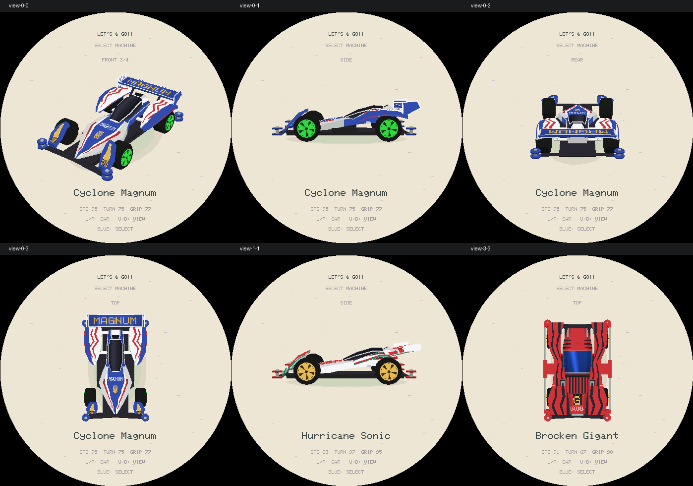

# R21：交互视角与侧视轮动

## 操作和动画

- 选车页左右换车，上下循环 FRONT 3/4 → SIDE → REAR → TOP；向上反向循环。斜向输入锁定先触发的主轴，回中才解锁，避免同时换车和换视角。
- 视角切换 350 ms，以当前姿态为起点，支持途中反向；绕最短角度转动，并在过渡中轻微拉远，避免长车身压住标题或车名。
- 换车保留视角，新车从左右小幅滑入并恢复缩放；复用单车模型缓存，不同时驻留两套模型。
- 斜前视保留原来的轻微自动摆动。侧／后／俯视保持准确观察角度。
- **只有到达侧视图之后车轮才转动**；离开侧视图即冻结当前轮动相位，不跳回初始辐条角度。确认展示沿用此规则，对手选择预览车轮静止，比赛车轮动画不变。
- Neo Tridagger ZMC 保留实心轮盖／碟形轮毂；旋转对称的轮面没有明显转动视觉，不为动效擅自加辐条或改模型。
- Blue 确认、Red 返回、双键长按退出不变。Y 轴只用于选车视角，不接入驾驶控制。

## 自审一：状态与输入

检查单轴锁定、长按重复、回中释放、NaN、中断改向、换车保留视角、毫秒计数回绕和轮动起止。修正双键退出期间菜单仍能导航的问题；非有限 Y 归零，但不破坏有效的比赛 X 轴。动画使用独立的应用时钟，换车重置页面时间不会重置镜头。

## 自审二：视觉与集成

生产渲染逐顶点检查 4 车 × 3 档细节 × 9 个正反向状态 × 6 个过渡时刻，共 648 组。检查圆屏边界、352×288 光栅缓存边界及标题／车名安全区。

发现旧斜前构图贴近车名、俯视和斜前／后视过渡时车身投影超高；调整构图，并加入过渡拉远。测试实际渲染帧的侧视辐条变化和其他视角的静止轮动相位，保留 Neo 的对称轮面例外。沿用生产变换函数，避免测试和实际画面用两套投影。

## 复验

```sh
SANITIZE=1 bash tools/test_lets_and_go.sh
source ../esp-idf/export.sh
idf.py build
```

视角控制器主机大小 88 B，不新增模型、帧缓存或线程。缓存仍为常驻车库 3,000 B／比赛 3,216 B，打开时表面缓存车库 591,128 B／比赛 481,584 B。

31 套 ASan／UBSan 回归全部通过（15 游戏、15 Vector Run、1 Launcher，另含生产渲染验证）。ESP-IDF 构建通过，镜像 `0x4a3e60`，分区余量 `0x4c1a0`（6%）。

未烧录、未推送。真机仍需验证上下方向、连续切换手感、侧视轮动流畅度和渲染帧率；桌面渲染不能替代设备验收。


