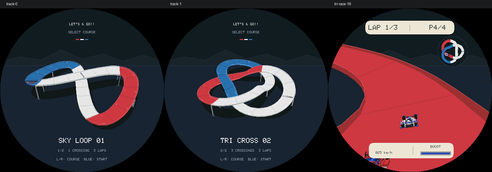

# R22：第二条立交赛道 TRI CROSS 02

## 玩法与路线

保留 SKY LOOP 01，新增三叶形、三处上下交叉的 TRI CROSS 02。新路线沿一条连续闭环依次通过三个立交，上下坡和连续弯更多，仍只设左右外墙、不加中间隔板，单人及最多三名对手均跑三圈。

选道页左右摇杆循环两条路线，Blue 开始，Red 返回；机身原“上一项”键也可换道。重赛保留赛道。模型、车库视角、侧视轮动、音效及 BGM 不变。

新赛道长约 140.19 个游戏距离单位，路线宽度沿用 3.3 单位；上下交叉中心高差 4.4 单位。路线是程序生成的三叶立交，不声称复刻某款田宫商品套装。配色、拼装接缝、侧墙和暗色背景沿用 R19 风格。

## 实现

- `TrackId::TriCross` 加入赛道目录，`OverpassTrack` 按赛道 ID 建立弧长表；选道、物理、AI、排名及三圈判定共用同一条路线。
- 车库预览和比赛缓存按赛道 ID 刷新，切换后不沿用旧跑道。小地图根据实际路线重新拟合范围，车辆标记共享同一投影。
- 保存结构升至 V2，两条赛道分别记录最快圈；显式迁移 V1 的 8 字节存档，保留车型和 SKY LOOP 记录，新赛道记录初始为空。
- 仍复用 96 段赛道和固定表面缓存，没有双赛道网格常驻缓存，不增加线程或逐帧分配。

## 第一轮自审：几何与状态

检查闭环连续、切线、内侧边缘、非相邻路段净空和三处交叉。720 段扫描找到恰好三个交叉；近邻非相邻路段中心高差最小约 3.91 单位，为车身、倾斜和护栏留有余量。

修复单赛道时期的隐含假设：比赛渲染器原先始终缓存默认跑道；地图固定比例可能超出圆框；存档尺寸变化会丢弃旧成绩。新增缓存重建、地图自适应和迁移测试。桥墩生成也改为检查下方完整路带，不再仅避开世界原点。

## 第二轮自审：视觉与驾驶

初稿坡道偏陡、预览偏小，降低起伏高度并拉近预览；全路线正反复切换、三档画质和 16 个预览朝向检查标题、车名与圆屏安全区。新赛道曲率按平面切线和实际局部速度计算，避免将坡顶的垂向变化错误地计入横向转弯力度；旧赛道的已调手感保持不变。

两赛道各 96 个比赛位置覆盖三档画质；复用渲染器与重新打开渲染器逐像素比较，验证切换后无旧赛道／旧小地图残留。地图车辆标记增加每条路线 720 个位置的圆形边界检查。

## 验证

31 套 ASan／UBSan 回归：15 游戏、15 Vector Run、1 Launcher，另含生产渲染检查。比赛策略扩展至两赛道共 768 场；新赛道四车型均验证干净超车路线优于只按 Boost。长跑扩展至 128 组，覆盖两赛道、四车型和 0–3 对手，全部完成三圈。

ESP-IDF 构建通过，镜像 `0x4a47c0`，分区剩余 `0x4b840`（6%）。主机 `sizeof`：车库渲染器 3,000 B、比赛渲染器 3,232 B；打开时表面缓存仍为 591,128 B／481,584 B。

```sh
SANITIZE=1 bash tools/test_lets_and_go.sh
source ../esp-idf/export.sh
idf.py build
```

未烧录、未推送。真机的坡道视野、操作难度、帧率和长时间音乐混音仍待验收；自动策略成绩不等同于真人难度评价。


