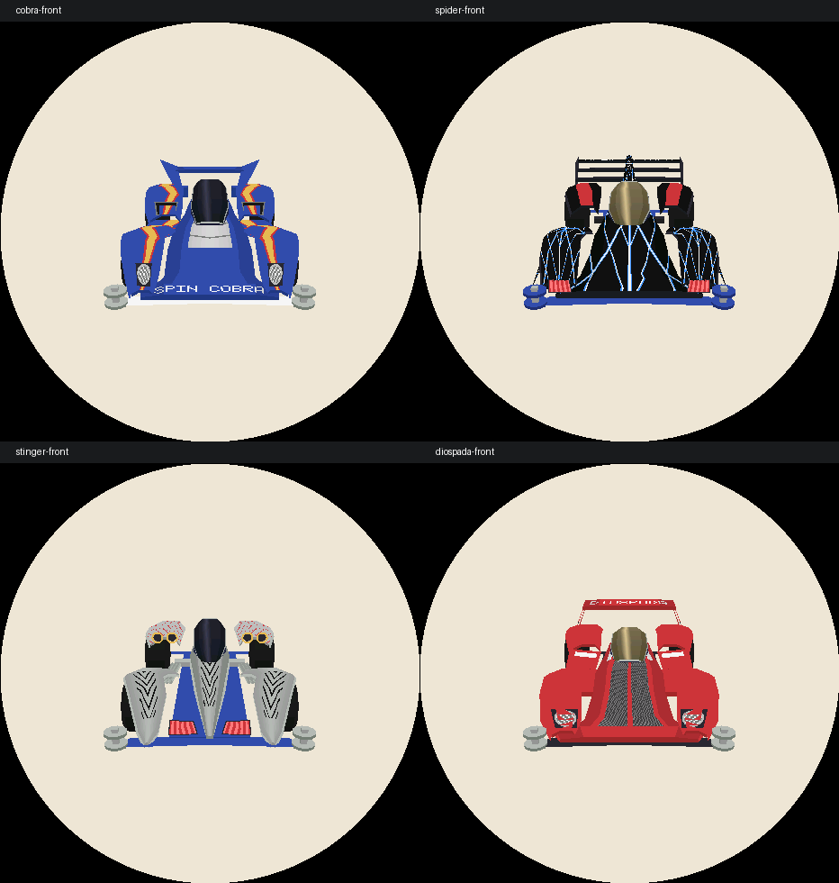
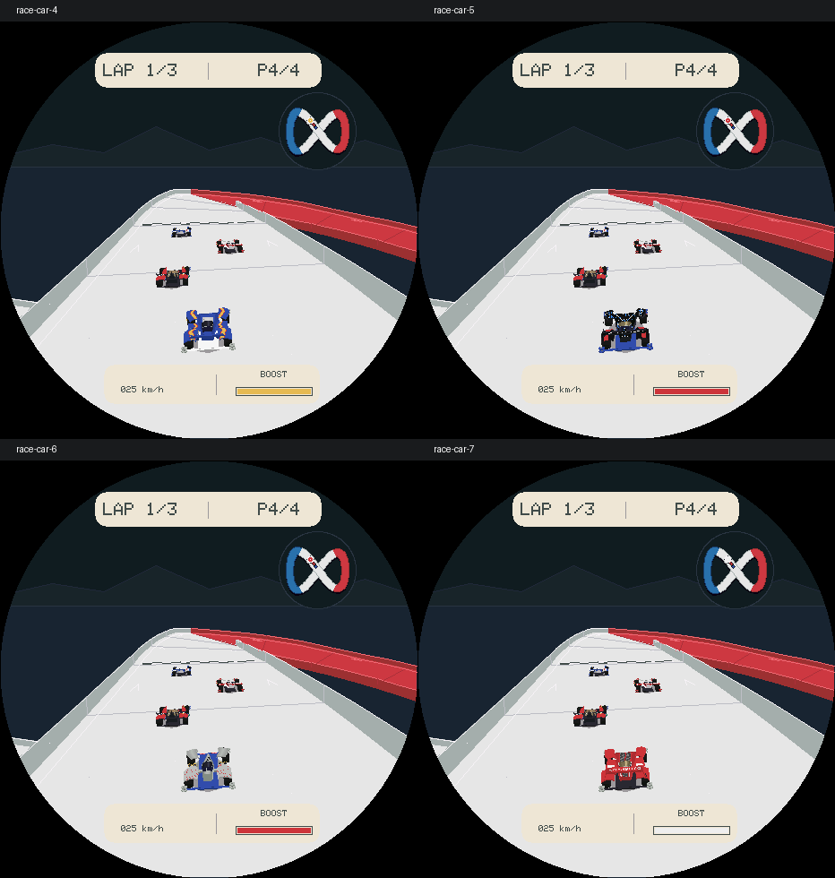

# R23：新增四台候选赛车

当前共 8 台可选赛车：保留原四车，追加 Spin Cobra、Beak Spider、Ray Stinger、Diospada。单场仍为玩家加 0–3 名对手，两条赛道均可使用全部车型。左右换车、上下切换四视角、350 ms 平滑过渡和仅侧视图轮动规则不变。

## 官方参考与模型

使用 Browser 技能逐张查看田宫官方实物照片，再手工构建独立实体部件和程序化涂装；未将官方商品图片作为游戏贴图。

| 新车 | 官方参考 | 本轮结构 |
| --- | --- | --- |
| Spin Cobra | [19450 Premium](https://www.tamiya.com/japan/products/19450/index.html)，150×97×38 mm | 独立前桥、蓝色宽轮罩、黄红火焰、银色前灯与引擎盖、分体尾翼、金色三辐轮毂 |
| Beak Spider | [19408 原版](https://www.tamiya.com/japan/products/19408/index.html)，132×90×41 mm | 黑色尖轮罩、蓝白蛛网、金色座舱、三层后翼及中央脊、蓝色底盘、红色盘式轮毂 |
| Ray Stinger | [19438 Premium](https://www.tamiya.com/english/products/19438/index.html)，150×97 mm | 银色尖鼻及独立前轮罩、黑纹、四个金色进气口、侧管、中央单片尾鳍，无横向尾翼 |
| Diospada | [19443 Premium](https://www.tamiya.com/english/products/19443/index.html)，155×97 mm | 红色超跑式轮罩、深色中轴涂装、金色座舱、开放侧进气道、拱形尾翼及侧支架三道开槽 |

Ray Stinger 和 Diospada 的上述商品页未公布高度，因此目录高度保留为 0（未知），不编造尺寸；实际渲染不依赖该字段。模型是适配圆屏和嵌入式预算的程序化近似还原，不是官方 CAD 或精确工程模型。

车库高精度／比赛中精度／比赛低精度共用每台车的独立车壳结构，仅细分和细节级别不同。新增四车高精度面板数分别为 1,135／1,231／1,251／1,133；三档均在原有预算内。旧 wireframe 辅助接口保留共用简模元数据，不是当前游戏画面的模型来源。

## 第一轮自审：几何与边界

- 按官方照片核对前后轮罩、座舱、尾翼层数、进气口和轮毂辐数。三档模型进行轮胎净空采样和镜像 UV 检查，修正 Spider 侧护翼穿胎、Stinger 前罩下沿穿胎。
- 枚举 8 台玩家车型，确认每台均可遍历另外 7 台候选车及 READY，不会选择自身，最多只能勾选 3 台。
- 比赛准备增加硬性对手上限，异常的 `0xff` 掩码也不会写出四车数组。验证所有 512 种合法玩家／对手组合。
- 原四车 ID 0–3 不变，新 ID 4–7 追加；最高 ID 的 V2 存档往返通过，已有 V1/V2 迁移行为保留。

## 第二轮自审：实际画面与缓存

- 检查生产渲染器的多视角和比赛输出。减少 Spider 蛛网密度，移除 Cobra 重复拉伸车名，将 Diospada 三道通风槽限定在尾翼支架；抬高 Cobra 灯面避免被轮罩遮盖。
- 车名采用深色铅笔色，避免白色／金色车型强调色在纸色背景上失去对比度；选车标题显示当前序号和总数。
- 比赛只缓存当前最多四台参赛车，不为八台候选车同时分配模型。按参赛槽的车型 ID 和画质更新；非活动槽失效，修复单人低画质切回四车时沿用旧画质的问题。
- 六步新旧车型混合、单人／四车及画质切换，复用缓存和全新渲染器逐像素一致。8 车 × 9 个正反视角状态 × 3 档画质 × 6 个姿态，共 1,296 组构图检查通过。

## 验证与预算

运行 `SANITIZE=1 bash tools/test_lets_and_go.sh`：15 套游戏、15 套 Vector Run 和 Launcher 回归通过，另含生产渲染检查。两赛道八车型共 1,536 场策略测试、128 组最长 180 秒比赛场景通过；无人操作不能获胜，干净超车策略优于只按 Boost。自动策略不替代真人手感验收。

ESP-IDF 编译通过，镜像 `0x4a7370`，分区剩余 `0x48c90`（6%）。主机测量：常驻车库／比赛渲染器 3,000／3,232 B；打开时缓存 591,128／481,592 B。比赛缓存相比 R22 仅增加 8 B，没有随候选车翻倍。

本轮仅本地阶段提交，未推送、未烧录。真机帧率、圆屏效果及操作体验待设备验收。

