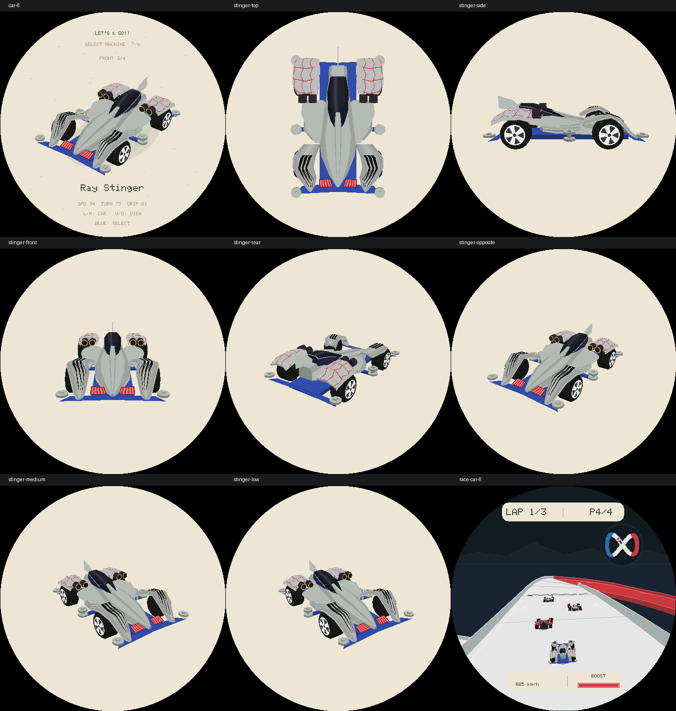
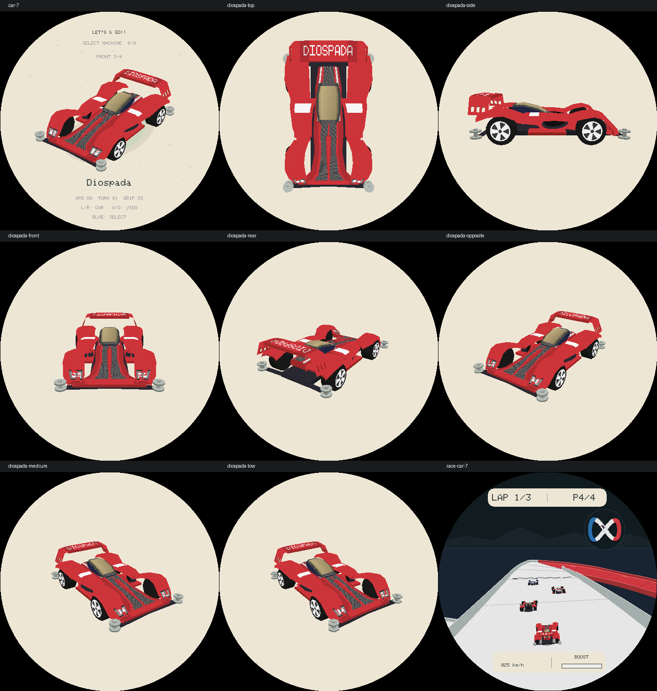
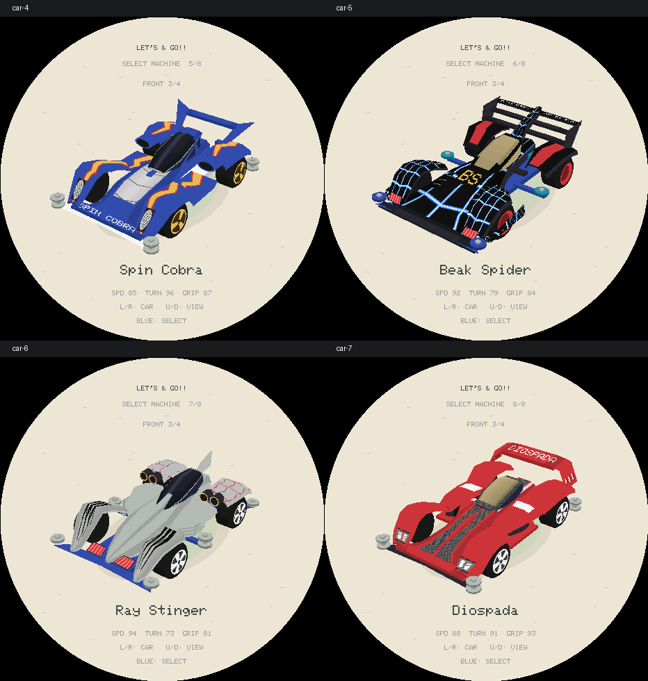
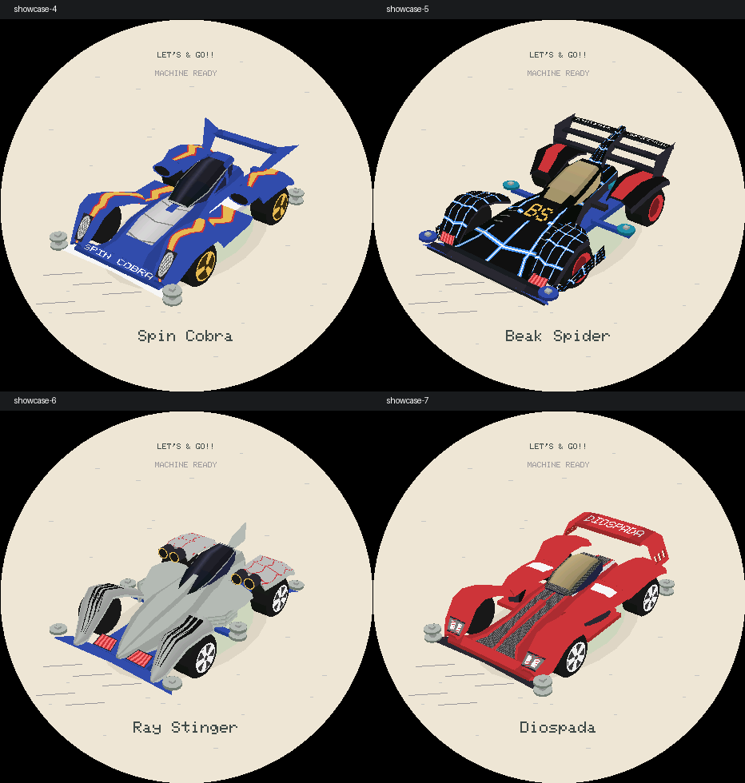
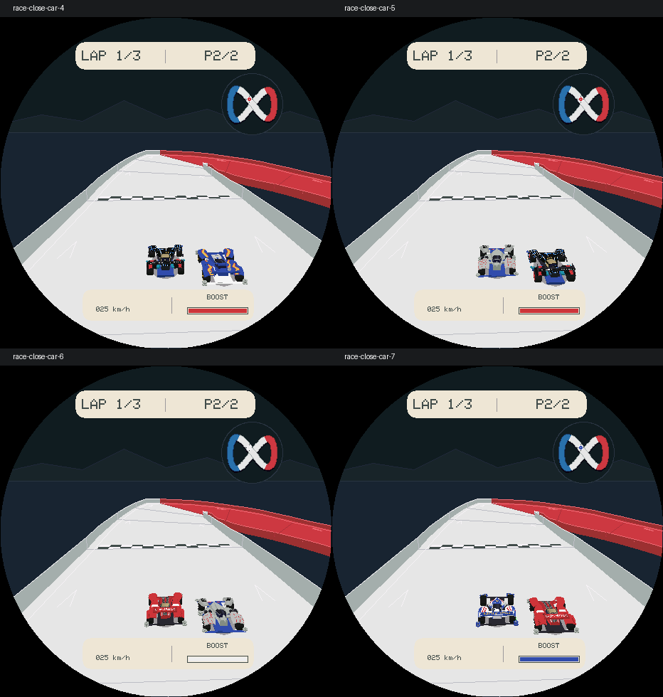

# R24：新增四车逐台结构优化

本轮回顾 R17／R18 后，按 [车型建模与优化规范](Lets-And-Go-Racer-车型建模与优化规范.md) 依次优化 R23 新增的四辆车。原四车作为回归基线，不重做操控、赛道或音频。规范同时通过赛车目录的 `AGENTS.md` 接入后续开发入口。

参考照片经 Browser 技能实际查看；模型仍为手工近似，不是官方 CAD。没有同版本裸壳／背面证据的细节不声称精确还原。模型坐标为设计约束，不是实测尺寸。

## A. Spin Cobra / 19450 Premium

参考：[官方产品页](https://www.tamiya.com/english/products/19450/index.html)、[官方实拍](https://d7z22c0gz59ng.cloudfront.net/japan_contents/img/usr/item/1/19450/19450_1.jpg)。辨识点是宽大前罩、银色分段车头、座舱两侧黑色进气口、独立尾翼侧板及三辐金轮。

结构卡：R23 的座舱腰部偏宽，后罩前端格栅是一张平面，银色盖板过于平直，座舱缺侧窗框。收窄腰部、保留后罩旁通道；截短后罩并接上有唇、内壁与后腔的椭圆进气口，加入侧窗框、上部盖板与侧裙折边。

第一轮：三档检查腰线和轮胎净空，通过。新增正面深度探针，验证进气口中央后腔低于口沿，而不是单凭面数判定“已细化”。低档六边形的顶部探针落在边外，调整到各档均覆盖的水平口沿采样位置；不放宽穿胎容差。

第二轮：生产画面发现前灯纵向偏短，沿前罩拉长；将银色涂装限定为前部三段后掠肋纹，保留中央蓝色脊。检查俯／侧／前／后／反向斜视、三档、选车与比赛，其他七车选车和检查视角与 R23 基线逐字节一致。

High／Medium／Low：1,239／999／759 面，缓存不变。完整 ASan／UBSan 与生产渲染回归、ESP-IDF 编译通过后阶段提交。

## B. Beak Spider / 19408 原版

参考：[官方产品页](https://www.tamiya.com/japan/products/19408/index.html)、[实拍](https://d7z22c0gz59ng.cloudfront.net/japan_contents/img/usr/item/1/19408/19408_1.jpg)。按原版的前轮后包围、金色硬边窗、三层后翼、红色盘轮、蓝色前导轮和青色侧导轮核对，不混入其他底盘版本。

结构卡：R23 风挡过圆、前肩偏窄、外护翼末端不完整；蓝白纹样重复为放射星形，后导轮位置为通用配置。拓宽前肩与风挡前端，补黑色窗框、前横桥、护翼两端连接和侧导轮支架；保留三层翼之间的真空隙。

第一轮：三档轮胎净空、护翼回包、宽风挡／前肩和导轮位置检查通过。网纹改为沿车壳弯折的蓝白网格，补车鼻 BS 色标和肩部通风格；尾翼文字分到中央脊两侧。

第二轮：全视角检查发现导轮移到侧面后仍残留通用后保险杠尖角，删除空支架并补防回退断言。检查选车、三档、侧／后方和比赛；旧四车及未处理新车相对 R23 基线不变。

High／Medium／Low：1,171／955／739 面，比 R23 更少而不是靠堆面数。完整 ASan／UBSan、生产渲染回归及 ESP-IDF 编译通过后阶段提交。

## C. Ray Stinger / 19438 Premium

参考：[官方产品页](https://www.tamiya.com/english/products/19438/index.html)、[实拍](https://d7z22c0gz59ng.cloudfront.net/japan_contents/img/usr/item/1/19438/19438_1.jpg)。重点是三尖前端、贯穿中央的银色刀脊、黑色座舱、四个金色喇叭口、弯折侧管与单片尾鳍。

结构卡：R23 中轴过窄像独立细杆，进气口只有环片，侧管是直条，尾鳍未封边。拓宽刀脊下的主体并独立抬高脊线；四口使用内壁／后腔／口沿三层结构，银色弯管绕过两侧，中央尾鳍居中并补薄边。

第一轮：三档四口深度、口沿、刀脊高差和轮胎间隙通过。去掉主车鼻错误的重复黑纹，只在前罩保留分叉纹；后罩红纹改成较疏的折线。

第二轮：实渲染发现侧连接片仍像宽平板，改为四截面渐收肩壳；金色口沿之外的管壳改为深色，避免俯视呈金色方块。补实拍中部双层导轮和独立支架，前后导轮改为单层。Cobra／Spider 的九宫格生产输出与各自阶段版本逐字节一致。

High／Medium／Low：1,565／1,265／965 面；全部回归与 ESP-IDF 编译通过，固件 `0x4a7fe0`，分区余量 `0x48020`（6%），缓存不变。

## D. Diospada / 19443 Premium

参考：[官方产品页](https://www.tamiya.com/english/products/19443/index.html)、[实拍](https://d7z22c0gz59ng.cloudfront.net/japan_contents/img/usr/item/1/19443/19443_1.jpg)。以跑车式侧进气道、深色中轴／金色风挡、红色中央脊与拱翼肩部三道窄槽作为辨识点。

结构卡：R23 只有平直侧框，翼侧的黑纹没有实际开口，风挡像圆泡，前灯沿用 Cobra 材质。改成有倾角、口沿和内壁的侧进气道，收窄前部中央壳并加红色脊；拓宽带深色框的金色风挡，单独绘制双灯。尾翼的横向顶部与渐降侧肩连续连接，三道槽由真实缺面和槽壁构成。

第一轮：三档轮胎净空通过；侧面深度探针确认进气道后腔相对唇口内缩。翼肩每条槽都有穿透探针，槽间横条单独验证，不能用整面黑色涂装蒙混通过。

第二轮：侧视发现翼槽过长、像栅栏，缩短到肩部下段的窄槽；进气口扩大垂向开口并更朝前倾斜。去掉已无用途的假开槽材质。检查后视、反向斜视、比赛默认／低档，槽后面没有补面封死。

High／Medium／Low：1,335／1,101／867 面，仍在原容量内。

## 联合复验与发现的测试盲区

最终人工查看发现，原 `showcase-0…7` 测试只重设了选车光标，没有在 `GameFlow` 中确认目标车，实际一直渲染 Magnum。修正测试设置，并对不同车型的展示输出加入哈希去重检查。此问题属于主机测试覆盖不足，不是生产游戏确认车型错误；本轮修正后重新检查全部八台的展示画面，而不沿用之前“测试通过”的推断。

增加合法双车组合，使八款车分别成为近距离对手；调整检查位置，让目标车身位于 HUD 上方。原有极近 `race-close` 裁剪压力场景保留，不以新取景替代。每帧相同的生产赛车网格、材质和缓存仍参与测试。

最终门禁：31 套 ASan／UBSan 回归（15 游戏、15 Vector Run、1 Launcher）及生产渲染通过；1,536 场策略、128 组长跑、512 种合法参赛组合、1,296 组车库构图状态均保留。原四车的选车及七个检查视角，共 32 个像素文件，相对 R23 基线逐字节一致；Cobra／Spider／Stinger 各自阶段保存的九宫格在后续模型修改后也保持一致。

打开期车库／比赛缓存仍为 591,128／481,592 B；常驻渲染器 3,000／3,232 B。最终单独运行 ESP-IDF 编译通过，固件 `0x4a87f0`，最小分区 `0x4f0000`，余量 `0x47810`（6%）。没有改依赖、操控、物理性能、赛道或音频。

本地阶段提交：Cobra／规范 `28ebcce`，Spider `f28967e`，Stinger `f609411`；最后一次阶段包含 Diospada 和联合测试修正。未 push、未烧录，真机帧率、PSRAM 运行余量和显示效果待设备验收。照片没有提供完整背面与内部工程结构，因此模型仍是有明确约束的近似还原，不是完全精确复刻。

[同场景修改前](assets/lets-and-go-r24-before.png)

