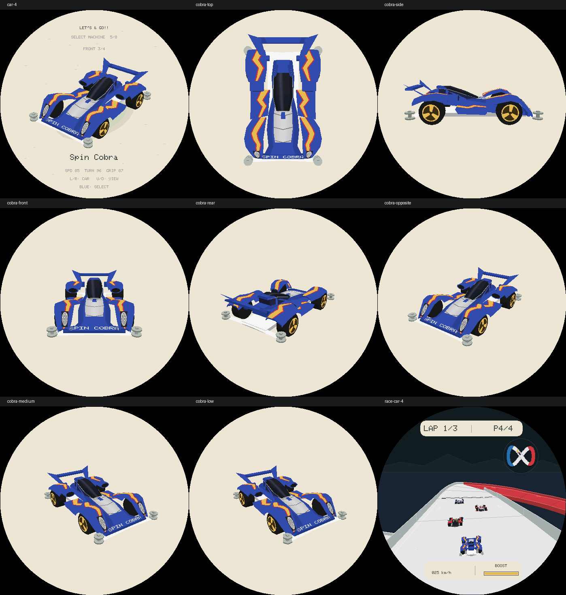
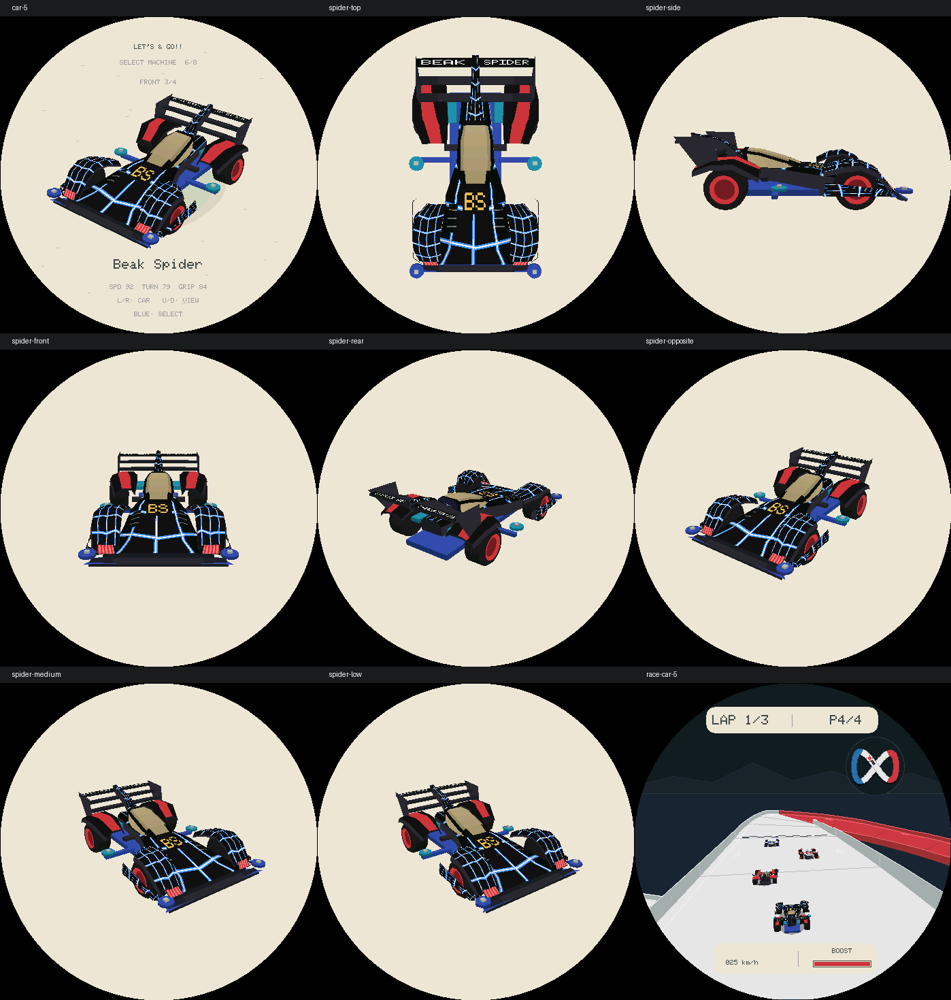

# R24：新增四车逐台结构优化

本轮回顾 R17／R18 后，按 [车型建模与优化规范](Lets-And-Go-Racer-车型建模与优化规范.md) 依次优化 R23 新增的四辆车。原四车作为回归基线，不重做操控、赛道或音频。规范同时通过赛车目录的 `AGENTS.md` 接入后续开发入口。

参考照片经 Browser 技能实际查看；模型仍为手工近似，不是官方 CAD。没有同版本裸壳／背面证据的细节不声称精确还原。模型坐标为设计约束，不是实测尺寸。

## A. Spin Cobra / 19450 Premium

参考：[官方产品页](https://www.tamiya.com/english/products/19450/index.html)、[官方实拍](https://d7z22c0gz59ng.cloudfront.net/japan_contents/img/usr/item/1/19450/19450_1.jpg)。辨识点是宽大前罩、银色分段车头、座舱两侧黑色进气口、独立尾翼侧板及三辐金轮。

结构卡：R23 的座舱腰部偏宽，后罩前端格栅是一张平面，银色盖板过于平直，座舱缺侧窗框。收窄腰部、保留后罩旁通道；截短后罩并接上有唇、内壁与后腔的椭圆进气口，加入侧窗框、上部盖板与侧裙折边。

第一轮：三档检查腰线和轮胎净空，通过。新增正面深度探针，验证进气口中央后腔低于口沿，而不是单凭面数判定“已细化”。低档六边形的顶部探针落在边外，调整到各档均覆盖的水平口沿采样位置；不放宽穿胎容差。

第二轮：生产画面发现前灯纵向偏短，沿前罩拉长；将银色涂装限定为前部三段后掠肋纹，保留中央蓝色脊。检查俯／侧／前／后／反向斜视、三档、选车与比赛，其他七车选车和检查视角与 R23 基线逐字节一致。

High／Medium／Low：1,239／999／759 面，缓存不变。完整 ASan／UBSan 与生产渲染回归、ESP-IDF 编译通过后阶段提交。

## B. Beak Spider / 19408 原版

参考：[官方产品页](https://www.tamiya.com/japan/products/19408/index.html)、[实拍](https://d7z22c0gz59ng.cloudfront.net/japan_contents/img/usr/item/1/19408/19408_1.jpg)。按原版的前轮后包围、金色硬边窗、三层后翼、红色盘轮、蓝色前导轮和青色侧导轮核对，不混入其他底盘版本。

结构卡：R23 风挡过圆、前肩偏窄、外护翼末端不完整；蓝白纹样重复为放射星形，后导轮位置为通用配置。拓宽前肩与风挡前端，补黑色窗框、前横桥、护翼两端连接和侧导轮支架；保留三层翼之间的真空隙。

第一轮：三档轮胎净空、护翼回包、宽风挡／前肩和导轮位置检查通过。网纹改为沿车壳弯折的蓝白网格，补车鼻 BS 色标和肩部通风格；尾翼文字分到中央脊两侧。

第二轮：全视角检查发现导轮移到侧面后仍残留通用后保险杠尖角，删除空支架并补防回退断言。检查选车、三档、侧／后方和比赛；旧四车及未处理新车相对 R23 基线不变。

High／Medium／Low：1,171／955／739 面，比 R23 更少而不是靠堆面数。完整 ASan／UBSan、生产渲染回归及 ESP-IDF 编译通过后阶段提交。

## 后续阶段

Ray Stinger、Diospada 按相同流程逐台记录，完成后更新本节。
