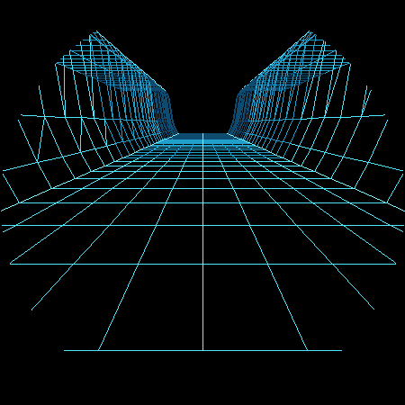
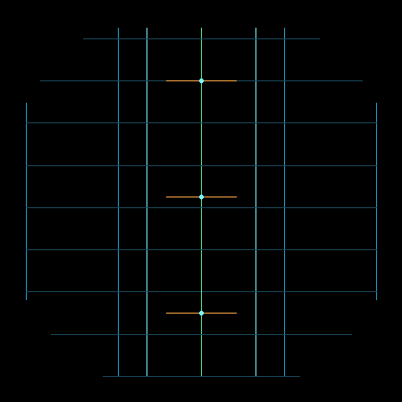
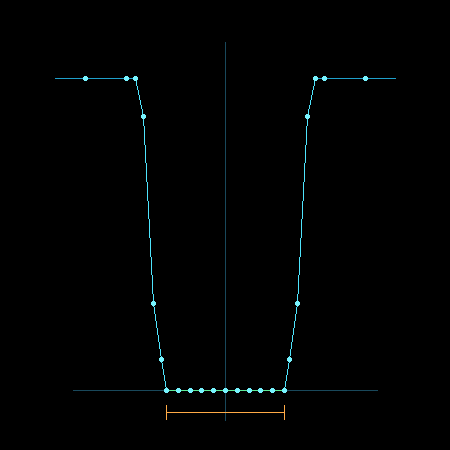

# Vector Canyon Fighter G3：A1 直线显式峡谷评审

> 状态：等待用户确认
> 日期：2026-09-02
> 上一节点：A0 显式悬崖峡谷算法研究（已确认，commit `e8d5569`）

## 1. 本阶段边界

A1 只回答一个问题：不依赖山脊噪声，仅用显式横截面，能否形成清楚的平谷底、陡侧壁和平顶台地。

本阶段刻意不包含：

- 弯曲中心线；
- 左右突出障碍；
- 流式运动；
- HUD、战机和发光特效；
- 真机代码修改与烧录。

实现位于独立工具 `tools/vector_canyon_explicit_a1_preview.cpp`，没有修改生产 `TerrainStream` 或 Renderer。

## 2. 固定几何参数

| 参数 | A1 值 |
| --- | ---: |
| 深度截面 | 34 |
| 每截面语义顶点 | 25 |
| 投影顶点总数 | 850 |
| 谷底有效半宽 | 2.18 |
| 谷底有效全宽 | 4.36 |
| 悬崖高度 | 3.80 |
| 主悬崖面坡角 | 约 80.8° |
| 中心线 | 完全笔直 |
| 谷底高度变化 | 0 |
| 台地高度变化 | 0 |
| 噪声/随机数 | 无 |

剖面从左到右保持固定语义：

```text
外台地 -> 内台地 -> 崖肩 -> 上部陡面 -> 下部陡面 -> 墙脚
       -> 平坦谷底 11 个节点
       -> 墙脚 -> 下部陡面 -> 上部陡面 -> 崖肩 -> 内台地 -> 外台地
```

## 3. 三视图证据

### 3.1 透视主视图



检查目标：地形在没有颜色填充和山脊起伏时，仍能读出谷底、陡面和台地；侧壁内部具有连续纵向导轨与横向剖面肋线。

### 3.2 俯视标架图



颜色约定：

- 绿色：中心线及局部切线 `T`；
- 橙色：局部横截面法线 `N`；
- 亮青色：左右墙脚；
- 蓝青色：崖顶和外台地导轨；
- 暗青色：等弧长截面肋线。

A1 为直线路线，因此 `T` 和 `N` 在三个抽样位置严格正交，所有截面间距相同。

### 3.3 横截面图



橙色尺寸线标记谷底有效宽度。左右墙脚、主陡面、崖肩和平顶台地由明确节点连接，不存在随机高度采样。

## 4. 自动检查

预览工具启动时会先验证：

- [x] 谷底 11 个节点高度全部为零；
- [x] 左右台地节点高度全部等于 `3.80`；
- [x] 左右剖面严格镜像；
- [x] 主悬崖坡角位于 `78°–85°`；
- [x] 每个截面中心位于同一条直线；
- [x] 34 个截面使用固定世界间距；
- [x] 验证失败时工具以非零状态退出。

构建检查：

```sh
c++ -std=c++17 -Wall -Wextra -Werror -pedantic \
  tools/vector_canyon_explicit_a1_preview.cpp \
  -o /tmp/vector_canyon_explicit_a1_preview
```

## 5. A1 Checklist Review

- [x] 一条完全笔直的中心线；
- [x] 左右各 5 个以上悬崖剖面层；
- [x] 谷底与台地严格平坦；
- [x] 一眼可区分谷底、陡面、台地；
- [x] 无噪声、无障碍、无 HUD、无战机；
- [x] 850 个投影顶点，网格密度不是少量大折板；
- [x] 侧壁内部同时存在横向肋线和纵向导轨；
- [x] 未修改生产地形、渲染、输入或碰撞代码。

## 6. Review 判断

A1 通过内部 Review。

它证明显式剖面即使完全取消山峰与谷底起伏，也能比现有高度场更直接地表达悬崖空间。透视图当前的笔直、对称和规则是 A1 的有意限制，不是最终地图风格；只有在这一拓扑基线确认后，A2 才会引入弯曲中心线、弧长采样和局部法线旋转。

用户确认 A1 前，不提交本阶段代码和图片，不进入 A2。
