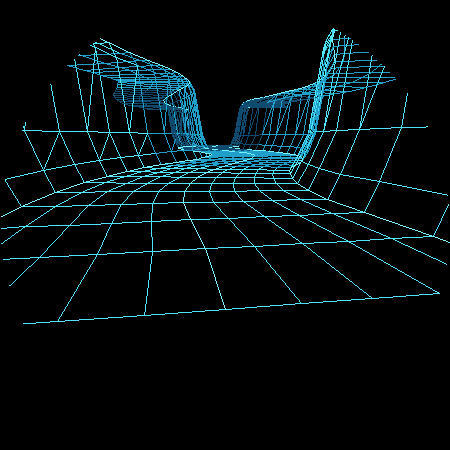
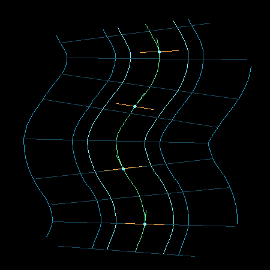

# Vector Canyon Fighter G3：A2 曲线中心线与局部标架评审

> 状态：等待用户确认
> 日期：2026-09-02
> 上一节点：A1 直线显式峡谷（已确认，commit `4af6b43`）

## 1. 本阶段问题

A2 只验证：显式峡谷沿弯曲中心线延伸时，横截面能否始终使用当前位置的局部法线，纵向导轨能否连续跟随路线，并避免现有实现中“横排只沿全局 X 平移”的错误。

本阶段保持不变：

- A1 的 25 点固定横截面；
- 谷底有效全宽 `4.36`；
- 主悬崖坡角约 `80.8°`；
- 平坦谷底与平顶台地；
- 左右完全等宽，不生成突出障碍；
- 不加入 HUD、战机、动画和真机渲染。

## 2. 曲线算法

1. 使用 11 个稀疏控制点定义测试路线；
2. 使用向心 Catmull–Rom（`alpha = 0.5`）生成稠密曲线；
3. 建立累计弧长表；
4. 将曲线重采样为 34 个等弧长截面；
5. 由相邻弧长点计算单位切线 `T`；
6. 在水平面计算单位法线 `N = (Tz, -Tx)`；
7. 用 `P = C + N*u + Up*h` 扫掠 A1 横截面；
8. 相同语义索引沿路线连接为纵向导轨。

没有对投影后的二维线条做角度修正。

## 3. 三视图证据

### 3.1 透视主视图



可见结果：

- 谷底横排随路线转向，不再始终朝屏幕或世界 X 轴；
- 墙脚、陡面、崖顶和台地纵线共同弯曲；
- 固定宽度的谷底没有发生突然收缩；
- 侧壁内部网格连续，没有断面或列错接。

### 3.2 俯视标架图



颜色约定：

- 绿色：中心线与抽样切线 `T`；
- 橙色：抽样法线 `N`；
- 亮青色：左右墙脚；
- 蓝青色：崖顶与外台地导轨；
- 暗青色：等弧长横截面。

俯视图是 A2 的主要验收证据：每排横截面都随绿色中心线旋转，橙色法线与绿色切线在世界平面中正交。

### 3.3 横截面回归图


A2 没有通过弯曲路线修改峡谷剖面。横截面与 A1 保持一致，用于排除“通过扭曲剖面伪造弯道”的实现偏差。

## 4. 量化结果

原始数据：[`a2-metrics.txt`](assets/vector-canyon-explicit-a2/a2-metrics.txt)

| 指标 | 结果 | 门槛 | 判断 |
| --- | ---: | ---: | --- |
| 截面数量 | 34 | 34 | 通过 |
| 曲线总弧长 | 36.916771 | — | 记录 |
| 目标弧长间距 | 1.118690 | 固定 | 通过 |
| 最小弦长间距 | 1.117707 | 与目标差 `< 0.02` | 通过 |
| 最大弦长间距 | 1.118690 | 与目标差 `< 0.02` | 通过 |
| `max(abs(dot(T,N)))` | 0.000000 | `< 0.001` | 通过 |
| `max(curvature * outerOffset)` | 0.779578 | `< 1.0` | 通过 |
| 中心线横向跨度 | 3.284108 | `>= 2.5` | 通过 |

外侧最大偏移为 `7.0`。曲率偏移乘积保持小于 1，左右最外侧导轨没有在弯道内侧折叠或倒退。

## 5. 自动检查

预览工具在生成图片前验证：

- [x] 所有 `T`、`N` 均为单位向量；
- [x] 所有抽样位置 `dot(T,N)` 接近零；
- [x] 相邻中心点弦长与目标弧长间距误差小于 `0.02`；
- [x] 世界 Z 单调前进，没有回头段；
- [x] `curvature * outerOffset < 0.95`；
- [x] 左右最外侧台地导轨均沿路线前进，没有翻面；
- [x] 中心线横向跨度足以明确观察弯曲；
- [x] 任一验证失败时工具以非零状态退出。

复现命令：

```sh
c++ -std=c++17 -Wall -Wextra -Werror -pedantic \
  tools/vector_canyon_explicit_a1_preview.cpp \
  -o /tmp/vector_canyon_explicit_preview

/tmp/vector_canyon_explicit_preview \
  docs/assets/vector-canyon-explicit-a2 a2
```

## 6. A2 Checklist Review

- [x] 使用弧长等距截面；
- [x] 每排在世界坐标中满足 `dot(T,N)` 接近零；
- [x] 俯视调试图显示中心线、墙脚、崖顶、切线与法线；
- [x] 横截面随路线旋转，无全局 X 方向滑动；
- [x] 墙脚线、崖顶线和外台地线连续；
- [x] 最外侧偏移曲线无翻面、交叉或倒退；
- [x] 不使用屏幕空间修正假造 90°；
- [x] A1 横截面没有被弯道逻辑破坏；
- [x] 生产 TerrainStream、Renderer、输入和碰撞代码未修改。

## 7. Review 判断

A2 通过内部 Review。

本阶段已经解决用户指出的“横线、纵线与世界路线关系不正确”这一结构性问题。透视视图中的部分交点不呈 90°，是透视与偏移曲线曲率的自然结果；俯视调试图证明生成基准本身正确。

当前路线仍然等宽、左右对称，因此还不具备躲避突崖的玩法信息。A3 应保持中心线和剖面算法不变，只分别加入一个左侧、一个右侧的有限支撑 `shoulder` 突出事件，并检查墙脚到崖顶是否整体连续变形。

用户确认 A2 前，不提交本阶段修改，不进入 A3。
