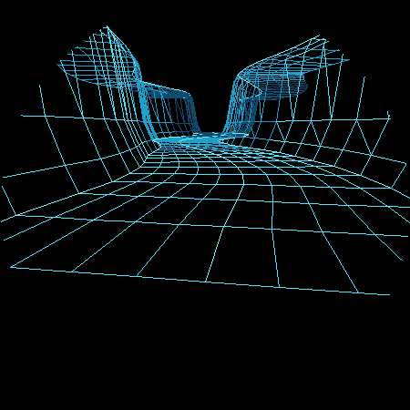
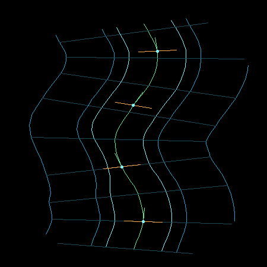
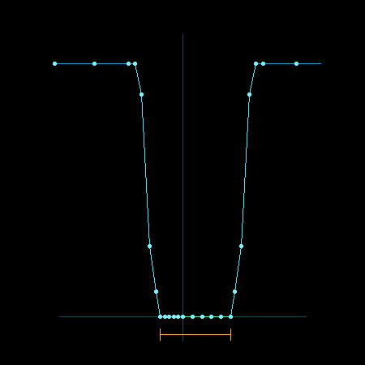
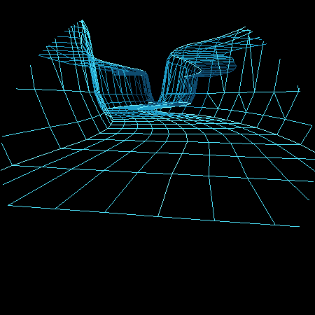
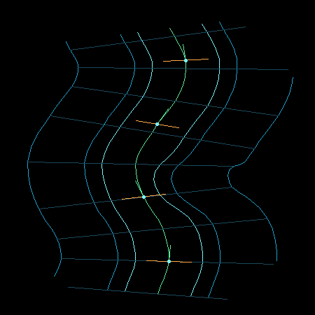
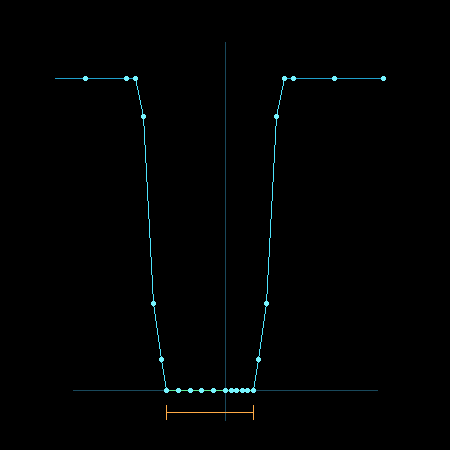

# Vector Canyon Fighter G3：A3 单侧突出悬崖评审

> 状态：等待用户确认
> 日期：2026-09-02
> 上一节点：A2 曲线中心线与局部标架（已确认，commit `8e645ca`）

## 1. 本阶段问题

A3 验证：左右峡谷边界能否独立变化，并让一个有限长度的悬崖突出同时驱动墙体、谷底网格和碰撞边界。

为排除左右事件互相干扰，本阶段生成两个独立测试场景：

1. 左侧只有一个 `shoulder`，右侧保持 A2 基准；
2. 右侧只有一个 `shoulder`，左侧保持 A2 基准。

两种场景使用完全相同的中心线、相机、横截面、事件长度和振幅。

## 2. 边界事件

单个事件使用有限支撑五次平滑函数：

```text
q = (s - eventCenter) / halfLength
x = clamp(1 - abs(q), 0, 1)
bump(q) = x^3 * (10 - 15x + 6x^2)
intrusion(s) = amplitude * bump(q)
```

当 `abs(q) >= 1` 时，突出量严格为零。A3 参数：

| 参数 | 数值 |
| --- | ---: |
| 事件中心弧长 | 14.542971 |
| 半长度 | 6.712140 |
| 总影响长度 | 13.424280 |
| 最大突出量 | 1.150000 |
| 基准单侧宽度 | 2.180000 |
| 突出侧最小宽度 | 1.030000 |
| 最小通道总宽度 | 3.210000 |

左侧事件只执行：

```text
W_left(s) = baseWidth - intrusion(s)
W_right(s) = baseWidth
```

右侧事件完全镜像。

## 3. 同一边界驱动三种结果

### 3.1 墙体整体平移

突出侧的墙脚、下部陡面、上部陡面、崖肩和台地使用同一个 `intrusion(s)`。每个剖面层相对墙脚的横向距离保持不变，所以不会出现“墙脚进来了、崖顶留在原处”的拉伸错误。

### 3.2 谷底网格压缩

中心纵线保持在路线中心。突出侧的 5 个谷底分格在中心线与新墙脚之间按比例压缩，未突出侧保持原始间距。谷底高度继续严格为零。

### 3.3 碰撞边界

可视墙脚和碰撞查询直接使用同一组：

```text
left boundary  = -W_left(s)
right boundary =  W_right(s)
```

未来战机横向位置为 `u` 时，两侧净空可直接计算：

```text
leftClearance  = u + W_left(s)  - shipHalfWidth
rightClearance = W_right(s) - u - shipHalfWidth
```

不需要从屏幕像素或渲染线反推碰撞。

## 4. 左侧突出证据

### 4.1 透视主视图



### 4.2 俯视边界图



俯视图中只有左侧墙脚、崖顶和台地在事件区向中心线突出；右侧各导轨与 A2 保持一致。

### 4.3 事件峰值横截面



## 5. 右侧突出证据

### 5.1 透视主视图



### 5.2 俯视边界图



### 5.3 事件峰值横截面



## 6. 量化结果

原始数据：[`a3-metrics.txt`](assets/vector-canyon-explicit-a3/a3-metrics.txt)

| 指标 | 左侧场景 | 右侧场景 | 门槛 | 判断 |
| --- | ---: | ---: | ---: | --- |
| 最大采样突出量 | 1.150000 | 1.150000 | 等于事件振幅 | 通过 |
| 最小通道总宽度 | 3.210000 | 3.210000 | `> 1.44` | 通过 |
| 最大相邻边界位移 | 0.333642 | 0.333642 | `< 0.40` | 通过 |
| 可视墙脚/碰撞边界最大误差 | 0.000001 | 0.000001 | `< 0.001` | 通过 |
| 墙体刚性剖面最大误差 | 0.000001 | 0.000001 | `< 0.001` | 通过 |
| 未突出侧宽度变化 | 0 | 0 | `= 0` | 通过 |
| 事件范围外残余突出 | 0 | 0 | `= 0` | 通过 |

`1.44` 来自当前战机全宽 `0.48` 加左右各 `0.48` 的 warning margin。A3 的最窄通道仍留有明显余量；这里只做静态可行性检查，最终障碍振幅还必须结合真实横移速度和预判距离验证。

## 7. A3 中发现并修正的相机问题

左右独立事件首次提供了不可混淆的方向基准。Review 时发现离线预览相机使用了：

```text
right = cross(forward, worldUp)
```

在当前右手坐标定义中会让世界左/右在屏幕上镜像。现已改为：

```text
right = cross(worldUp, forward)
up = cross(forward, right)
```

并重新生成 A1、A2 透视证据。该修正不改变任何地形顶点、曲线指标或横截面，只统一世界方向与屏幕方向。

## 8. 自动检查

- [x] 事件峰值精确采到完整振幅；
- [x] 事件范围外突出量严格为零；
- [x] 开始和结束截面恢复基准宽度；
- [x] 未激活一侧保持基准宽度；
- [x] 可视墙脚和碰撞宽度误差 `< 0.001`；
- [x] 整套墙体相对墙脚保持固定剖面；
- [x] 相邻截面边界位移不超过 `0.40`；
- [x] 左右最外侧导轨保持向前，没有翻面；
- [x] 最小通道宽度大于当前战机 warning 包络；
- [x] A1、A2 模式重新构建与运行通过；
- [x] 生产 TerrainStream、Renderer、输入和碰撞代码未修改。

## 9. A3 Checklist Review

- [x] 仅左侧生成一个宽缓 shoulder；
- [x] 仅右侧生成一个宽缓 shoulder；
- [x] 墙脚到崖顶整体连续变形；
- [x] 突出前后严格回到基准宽度；
- [x] 无山脊噪声仍具有明确地貌和躲避方向；
- [x] 可视边界与碰撞查询使用同一数据；
- [x] 谷底仍是平面，台地仍是平面；
- [x] 世界左/右与屏幕左/右一致。

## 10. Review 判断

A3 通过内部 Review。

这一阶段已经证明“侧面变化就是玩法”可以直接建立在显式峡谷拓扑上：不改变山顶高度、不制造山脊噪声，也能形成可预判的单侧悬崖障碍。

A4 应复用相同事件结构，加入 `left shoulder -> recovery -> right shoulder` 的 S-gate 语法、固定种子流式事件队列和近中远 LOD；此时才开始检查连续推进 60 秒与事件回收，不恢复 HUD 和战机。

用户确认 A3 前，不提交本阶段修改，不进入 A4。
