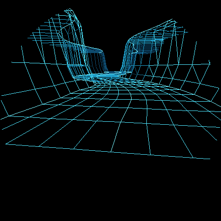
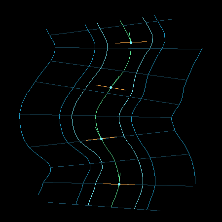
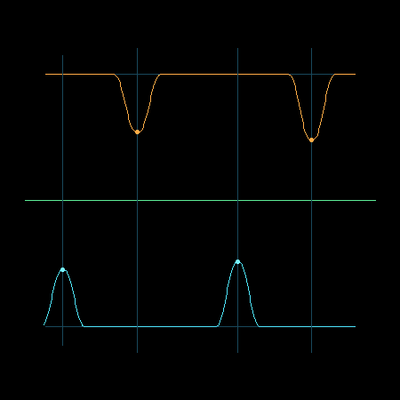
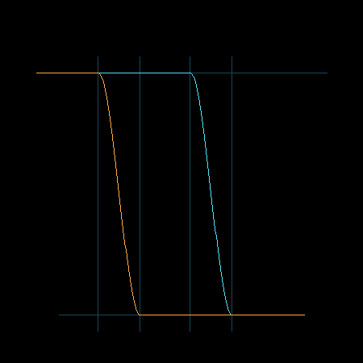

# Vector Canyon Fighter G3：A4 事件流、连续性与 LOD 评审

> 状态：等待用户确认
> 日期：2026-09-02
> 上一节点：A3 单侧突出悬崖（已确认，commit `19fe3ef`）

## 1. 本阶段问题

A4 验证以下算法能否共同成立：

- 把单个 shoulder 组织成 `左突出 -> 恢复段 -> 右突出` 的 S-gate；
- 用固定种子和事件索引生成可重复的无限世界事件流；
- 使用固定容量截面缓存和事件窗口，不依赖动态容器；
- 地形行回收后，同一世界位置仍得到完全相同的边界；
- 在最高地形流速下连续推进 60 秒不产生接缝或死路；
- 近、中、远纵向导轨通过连续权重切换，避免 LOD 突跳。

本阶段仍是独立离线原型，没有修改生产 `TerrainStream`、Renderer、输入或碰撞代码。

## 2. 固定种子事件流

### 2.1 事件索引，而非随机状态

每个事件由纯函数生成：

```text
event = streamEvent(seed, eventIndex)
```

事件参数只依赖：

- 固定种子；
- 事件索引；
- 固定 grammar 常量。

不保存“随机数生成到哪里”的可变状态。因此无论地形行何时回收、窗口从哪里重新进入，同一事件索引都会得到完全相同的 side、center、halfLength 和 amplitude。

### 2.2 S-gate grammar

一个周期占用 `44` 个世界弧长单位：

```text
cycle start
  -> 左 shoulder（中心约 +10）
  -> 明确 recovery
  -> 右 shoulder（中心约 +28）
  -> 更长 recovery
  -> next cycle
```

固定种子允许对中心、半长度和振幅做小幅确定性扰动：

- 半长度：`5.55–6.30`；
- 振幅：`0.88–1.15`；
- 中心位置抖动：不超过 `±0.60`；
- 左右事件支持区间不得重叠。

## 3. 固定容量流式窗口

### 3.1 地形截面缓存

- 固定 `34` 个 `CachedBoundarySlice`；
- 每个截面保存不可变世界 segment ID 和生成后的左右宽度；
- 相机跨过一个 segment 时，最近截面回收，最远端生成一个新 segment；
- 缓存中的旧截面每帧与纯函数重新查询结果对照；
- 不因相机相对位置变化重新随机生成形状。

### 3.2 事件窗口

- 使用显式 `std::array<ShoulderEvent, 6>`；
- 只装载与当前 34 截面世界范围相交的事件；
- 60 秒模拟中同时出现的最大事件数为 `3`；
- 容量溢出次数为 `0`；
- 不使用 `std::vector` 或帧内堆分配。

## 4. S-gate 视觉证据

### 4.1 带 LOD 的透视主视图



近处左侧悬崖突出，经过恢复区后，远处右侧悬崖突出。山顶和谷底保持平面，障碍信息完全来自侧壁边界。

### 4.2 俯视边界图



俯视图验证：

- 左右事件作用于不同边界；
- 两次突出之间存在基准宽度恢复段；
- 墙脚、崖顶和台地外沿同步变形；
- 中心线标架不受宽度事件破坏。

### 4.3 两周期边界时间线



颜色：

- 亮青色：左边界；
- 橙色：右边界；
- 绿色：中心线；
- 竖向暗线：事件中心。

每次突出离开有限支撑范围后都严格返回基准边界，没有低幅噪声残留。

## 5. 嵌套 LOD

纵向导轨分成三个严格嵌套集合：

| 层级 | 导轨 | 可见规则 |
| --- | --- | --- |
| structural | 中心、左右墙脚、左右崖顶、左右台地外沿，共 7 条 | 始终可见 |
| mid | 下部悬崖和两条谷底辅线，共 4 条 | 深度 `<=20` 全亮，`20–25` 平滑淡出 |
| fine | 剩余细分导轨 | 深度 `<=9` 全亮，`9–14` 平滑淡出 |

LOD 权重曲线：



- 绿色：structural，权重始终为 1；
- 青色：mid；
- 橙色：fine；
- 权重使用三次 smoothstep，不做某一帧突然删除；
- 最高流速下单帧最大权重变化为 `0.031675`，低于 `0.05` 门槛。

横向截面肋线继续保留，LOD 优先减少远景非结构纵线，不删除墙脚或崖顶。

## 6. 60 秒模拟结果

原始数据：[`a4-metrics.txt`](assets/vector-canyon-explicit-a4/a4-metrics.txt)

模拟条件：

- 30 FPS；
- 1800 帧；
- 使用当前 boost 后最高速度 `176` 对应的地形流速 `3.168`；
- 总推进距离约 `189.974`；
- 固定种子 `0xC4A71001`。

| 指标 | 结果 | 门槛 | 判断 |
| --- | ---: | ---: | --- |
| 截面回收次数 | 169 | `>150` | 通过 |
| 最大窗口事件数 | 3 / 6 | 不溢出 | 通过 |
| 事件窗口溢出次数 | 0 | `=0` | 通过 |
| 最小通道总宽度 | 3.229742 | `>1.44` | 通过 |
| 缓存/重新查询最大误差 | 0.000000 | `<0.000001` | 通过 |
| 相邻截面最大边界变化 | 0.393731 | `<0.40` | 通过 |
| 单帧最大 LOD 权重变化 | 0.031675 | `<0.05` | 通过 |
| 最小横移可达余量 | 2.213046 | `>0` | 通过 |

### 6.1 可达性门槛

对于每一组左/右事件：

```text
available lateral travel
    = maxLateralVelocity * recoveryDistance / worstTerrainSpeed

required target shift
    = (leftAmplitude + rightAmplitude) / 2
```

测试 6 个周期后的最小余量为 `2.213046`。该检查使用当前最大横移速度 `1.8` 和最高地形流速；它是生成阶段的保守静态门槛，进入真实控制阶段后还需加入输入响应和玩家反应时间。

### 6.2 确定性哈希

```text
first run:   17445385684075537385
repeat run:  17445385684075537385
other seed:   7905140194812917043
```

同种子逐帧、逐截面的边界哈希完全一致；不同种子产生不同结果。

## 7. 自动检查

- [x] S-gate 固定保持左事件先于右事件；
- [x] 左右事件支持区间之间存在 recovery；
- [x] 事件索引纯函数可重复；
- [x] 固定 34 截面缓存连续运行 1800 帧；
- [x] 同一世界 segment 缓存值不发生变化；
- [x] 新生成远端截面与独立查询一致；
- [x] 固定 6 事件窗口无溢出；
- [x] 相同种子哈希相同，不同种子哈希不同；
- [x] 所有通道通过最小宽度检查；
- [x] 6 个 S-gate 周期通过横移可达性检查；
- [x] LOD 集合严格嵌套；
- [x] LOD 权重逐帧连续；
- [x] A1、A2、A3 回归模式可重新构建运行；
- [x] 生产代码未修改。

## 8. A4 Checklist Review

- [x] 加入 `S-gate` 与 `recovery`；
- [x] 固定种子可完全复现；
- [x] 连续推进 60 秒无接缝、跳排或形态重算；
- [x] 所有通道通过最小宽度和初步可达性检查；
- [x] 近景、中景、远景 LOD 使用连续权重，无离散突变；
- [x] 无山脊噪声，障碍信息只来自左右侧壁；
- [x] 未提前恢复 HUD、战机或真机功能。

## 9. Review 判断

A4 通过内部 Review。

算法研究已经形成完整闭环：中心线标架定义网格方向，显式剖面定义悬崖体积，左右边界事件定义躲避玩法，固定种子事件流定义世界连续性，嵌套 LOD 控制真机线段预算。

在进入生产代码前，下一节点应先把 A1–A4 的原型结构整理成一份“生产接口与迁移清单”，明确替换 `TerrainSlice` 的字段、Renderer 只读职责、非对称碰撞公式和回退开关。该迁移设计 Review 通过后，才开始修改真机 `TerrainStream` 并烧录；这样仍符合本轮“只研究地图算法”的范围。

用户确认 A4 前，不提交本阶段修改，也不修改生产代码。
