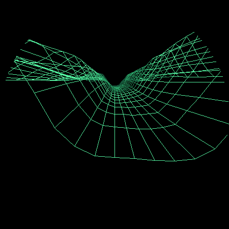
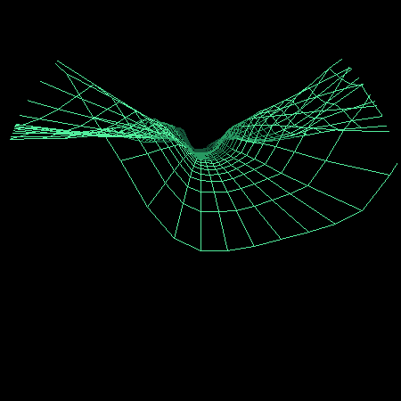
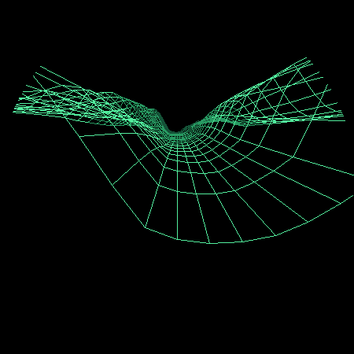

# Vector Canyon Fighter G3：R1 离线静态 Review

## 结论

R1 通过，可以进入 R2 真机静态渲染。本结论只覆盖骨架脊线高度场与静态构图，不覆盖动画帧率、战机细节、输入或碰撞。

## 最终实现基线

- 固定网格从方案初值 `31×22` 提升为 `37×26`；
- 962 个投影顶点，936 条横向边、925 条纵深边，共 1861 条地形网格边；
- 一条 Catmull–Rom 平滑中心骨架负责峡谷走向；
- 左右各三条独立正脊线负责主峰、山肩与外峰；
- 负谷线保留深槽结构，并按用户校准把平坦带总宽度从约 `1.64` 扩至约 `2.30` 世界单位；
- 两层固定种子 value noise 只补充低幅表面起伏；
- 所有高度由世界坐标和种子决定，帧内无随机数；
- 固件和离线预览直接复用同一份 `TerrainStream` C++ 实现。

## 静态样本

### 起始位置

### 中段位置

### 后段位置

## Checklist

- [x] 固定容量网格，无动态分配；
- [x] 一条连续谷线和左右各三条山脊；
- [x] 三个不同纵深位置均保持连续山脉；
- [x] 保留用户认可的深槽起伏；
- [x] 谷底宽度已扩大，通道不再过窄；
- [x] 不存在箱形截面或垂直挤出直墙；
- [x] 左右峰形、峰高和鞍部不完全镜像；
- [x] 横向和纵深网格都由同一连续高度场产生；
- [x] 主机 C++ 编译通过；
- [x] 离线预览工具使用固件同源模型。

## Review 中否决并修正的路线

1. 第一轮形成尖 V 谷底和近景空洞：增加谷底平坦带并调整近裁面；
2. 第二轮形成圆滑 U 形高墙：解除六条山脊长期平行的约束；
3. 第三轮形成低采样尖顶：网格提升为 `37×26`，收敛脊线漂移；
4. 第四轮悬崖感过强：水平透视与垂直夸张系数分离；
5. 曾尝试取消负谷线，但用户确认深槽更符合预期，因此撤回，仅扩大沟壑宽度。

## R2 必查风险

- 1861 条线在 30 FPS 下的真机成本尚未测量；
- 圆屏 OLED 的远景亮度可能低于桌面预览；
- 透明线框可能产生局部交叉杂线，但禁止重新引入覆盖纵线的黑色面片；
- 若性能不足，先对远景隔行绘制，不能删除近中景山体纵线；
- R2 必须先冻结地形运动，验证静态画面后才进入连续动画。
