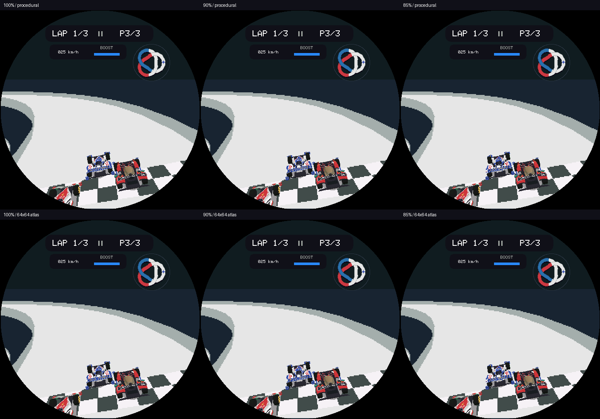

# 比赛玩家分辨率与材质缓存对照

2026-09-10，StopWatch / ESP32-S3，承接场景行复制优化。**本轮候选均未进入正式固件**；这里保留失败路径，避免重复尝试同一方案。

## 方法与边界

8 车型 × 2 赛道 × 13 个环道位置 × 6 方案；每组首帧预热，其余 12 帧计时，共 1152 次计时渲染、96 次预热渲染，另做 208 次恢复原生模式的 CRC 校验。一个比赛 renderer 与正常 garage 同时分配，所有方案共用；每个快照轮换执行顺序。玩家 Medium，两个对手 Minimal，速度状态 12m/s、种子 42；对手车道 ±0.55m，纵向 +0.5m / -0.25m，每四帧将一个对手改为 -2.2m，加入近裁剪状态。赛道遍历包含桥区，但这不是人工逐帧遮挡验收。

小场景 234×233、原生画布 468×466、比赛相机和玩家屏幕大小保持不变。玩家原生 112×112 tile；90% 使用 101×101、85% 使用 95×95，实际轴向比例约 90.18% / 84.82%。低分辨率颜色与深度使用最近邻放大；遮挡仍按目标原生像素坐标判断，HUD 和对手路径保持原策略。

64×64 RGB565 玩家材质缓存容量 16，纯像素预算 128KiB；材料键包括图案、颜色与光照，实际各车 5–12 项，未命中回退程序涂装。切换回程序涂装时保留已分配缓存，避免各方案运行内存环境不同；每车首次缓存构建在预热期，单独记录，不计入稳态均值。

总耗时包括同步全屏呈现，不包括 CRC、日志输出和快照设置；真实操纵、比赛音频、长期重入未测，不能用这些结果声称实际 FPS 或端到端输入延迟。未保存逐帧时间，只保存每组均值及最近秩 P95 / 最大值；每组 n=12，P95 等于最大值，不能据此计算全样本 P95 或置信区间。

## 真机结果

16 个车型／赛道组合等权均值，每组样本量相同。单位 ms，整帧为绘制＋呈现。

| 方案 | 玩家阶段 | 绘制 | 呈现 | 整帧 | 相比本轮原生基线 |
| --- | ---: | ---: | ---: | ---: | ---: |
| 100% 程序涂装 | 39.503 | 127.420 | 31.499 | 158.920 | — |
| 90% 程序涂装 | 41.873 | 130.098 | 31.502 | 161.600 | 慢 2.680 |
| 85% 程序涂装 | 40.938 | 128.797 | 31.520 | 160.317 | 慢 1.397 |
| 100% + 64×64 缓存 | 38.800 | 126.574 | 31.505 | 158.079 | 快 0.841 |
| 90% + 64×64 缓存 | 41.313 | 128.896 | 31.489 | 160.385 | 慢 1.466 |
| 85% + 64×64 缓存 | 40.461 | 128.131 | 31.496 | 159.627 | 慢 0.708 |

- 90% / 85% 程序涂装仅各 2/16 组整帧快于基线，平均分别慢 1.69% / 0.88%。本实现降低像素密度没有获得整体收益。
- 原生缓存的玩家阶段平均少 0.703ms；整帧平均少 0.841ms（0.53%），仅 10/16 组整帧快于基线，收益不足以支持默认启用。
- 首次构建 22.420–49.479ms。启动后到实验末尾的可用 PSRAM 净减少 135172 B（约 132.0KiB），内部 RAM 净减少 8 B。净变化包含分配及运行状态，不能全部归因于纹理像素本身。
- 本轮快照数量和对手位置与上轮复制实验不同；158.920ms 不能和上轮 166.26ms 相减当作新的优化收益。

## 画面与正确性证据

实验 renderer 的 ASan/UBSan 测试通过；切回默认模式后，356 张既有生产场景与前版逐字节一致。真机 208 次模式恢复 CRC 比较零差异，证明这些样本未留下模式／缓存状态污染；**不表示低分辨率画面与原生逐像素相同**。

主机加入缩放合成的原生比例对照、赛道坐标比例对照、HUD 保持及恢复默认模式检查。八车型的单一固定姿态中，原生缓存改变 31–66 个像素，90% / 85% 程序涂装改变 384–655 个像素。变动像素数只描述差异范围，不衡量感知清晰度。没有据此宣称全部桥下、并排车辆与近裁剪画面已获人工验收。

每张图从左到右、从上到下依次为：100% 程序涂装、90% 程序涂装、85% 程序涂装、100% 缓存、90% 缓存、85% 缓存。

另有 [车型 3](comparison-3.png)、[车型 6](comparison-6.png) 和 [逐车差异](visual-differences.json)。

## 判断与下一步

VIEW CAR 缩小交互时，减少了车辆的显示面积，也能减少合成与传输范围。比赛玩家保持原生显示大小时，降低内部密度只减少光栅工作，还增加屏幕坐标转换、颜色／深度放大；最终遮挡和写入仍覆盖原生像素。结合本轮玩家阶段变慢，当前缩放合成路径很可能抵消了光栅节省。稀疏 `CarStage` 日志没有方案标签，不能把它作为六方案逐阶段配对证据；下一轮需补充按方案记录的几何／光栅／合成时间来进一步归因。

缓存只能省去程序涂装计算，不能省掉几何、深度、合成和送显。玩家阶段仍接近 39ms，缓存后约省 0.7ms，不值得为当前画面默认增加 128KiB 像素容量和冷启动工作。这个结论针对当前程序涂装、屏幕覆盖与材质键，不排除其他更复杂材质获益。

后续优先测量车辆合成中赛道遮挡的候选数量与像素判断成本，研究保守的块级深度剔除或跨度复用。先要求原生画面 CRC 保持，再看跨车型稳态收益与最差帧；不立即再次降低画质。异步传输留在后面，需要独立解决画布所有权和输入／音频并行边界。

## 复现与交付

- 原始设备记录：[ab-device.log](ab-device.log)，烧录记录：[ab-flash.log](ab-flash.log)。
- 执行 `python3 docs/assets/race-quality-lab/analyze.py` 重新生成 [per-group.csv](per-group.csv) 和 [summary.json](summary.json)。
- `baseline/` 保存进入本轮前的七个文件；`experimental/` 保存候选实现、测试及临时设备入口。复制 renderer/atlas/raster 到原路径，`renderer_test.cpp` 对应 `tools/lets_and_go_renderer_test.cpp`；设备入口置于 renderer 目录，在 `main.cpp` 中声明 `qualityDeviceBenchmark()` 并在 HAL 与 Wifi 初始化后调用。在 CMake 为该入口配置 `-O2;-fno-builtin-memset`，重新配置再构建。只在专用实验固件中接入。
- 临时 BIN SHA-256：`05ec8ebaabb361a844de8740a0dca7d324c468631af1fcae6720010ae536e942`；ELF：`08c65ffc7be29e19188f5814364394bbd51b7c59f77e06bde630641fc7a654aa`。
- StopWatch 身份为 83401 / 303A:1001 / 44:1B:F6:C1:8A:00；只写 0x20000 应用分区。PaperColor 83301 未打开。
- 实验结束后恢复上述七个生产文件并删除临时入口，保留前轮场景复制、帧统计及已验收交互；正常固件复建与烧录证据见主报告交付记录。
