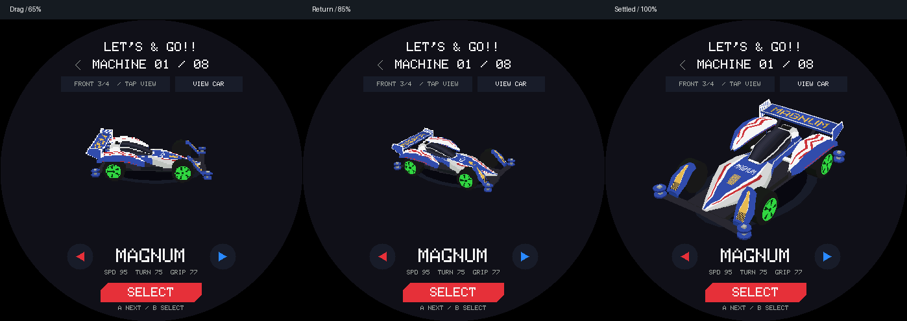

# 选车滑动查看渲染优化

2026-09-10，StopWatch / ESP32-S3。本轮把已验证的 VIEW CAR 优化方法接入选车预览，保留选车原来的缩小、回位、视角切换、车轮动画及控件布局。

## 正式策略

- 手指拖动：沿用原有模型 scale 上限 90，内部绘制 65%（229×187），不再额外缩小显示区域。
- 松手后的 350ms 回位、切换视角、换车动画：内部绘制 85%（299×245）。
- 动画结束的最后一帧恢复 100%（352×288）。SIDE 的持续车轮动画保持 100%，不会因为轮子在动而永久降采样。
- 低比例只作用于模型光栅；文字、按钮、阴影和最终画布仍按原生坐标绘制。保留原有模型 LOD 预算，没有把选车强制改成欣赏模式的 High 模型，也没有替换程序涂装或增加低精度贴图库。

`GarageInspectionCache` 增加使用完整 yaw／pitch／wheelPhase 的顶点准备函数。每个共享顶点每帧只变换、投影一次，面顺序、材质、UV 和近裁剪回退保持原样。复用已有缓存空间，不增加常驻顶点数组；换车型或模型 LOD 时重建索引，首次建索引沿用原有临时分配和失败回退。

同一选车页面且同一辆车已经显示后，清除并刷新 `(0,60,width,342)` 区域。该区域覆盖视角按钮、车身／阴影、车型文字、左右箭头和属性；完整宽度容纳原有换车位移。切页、首次呈现或换车先完整刷新；renderer 对缓存车型不一致也拒绝背景复用。屏幕下方 SELECT 与提示文字保持原生显示。

## 验证与复现

主机完整 ASan/UBSan 游戏、外设控制、Vector Run、Launcher 和生产 renderer 套件通过。新增检查覆盖：拖动保持、松手边界、慢帧跳过过渡、重新抓取、时间回绕、换车、SIDE 轮转；实际八车型的连续姿态中对比旧路径与共享顶点的原生画面，再对比局刷与完整重绘，并检查刷新区域之外的像素。既有 356 张生产画面逐字节一致。

真机三组模式共用一个 garage renderer，并同时保留正常 race renderer 的内存分配：

| mode | 顶点路径 | 绘制比例 | 呈现 |
| --- | --- | --- | --- |
| 0 | 原逐面变换 | 100% | 全屏 |
| 1 | 共享顶点 | 100% | 同车局刷 |
| 2 | 共享顶点 | 按拖动／过渡／稳定阶段 65%／85%／100% | 同车局刷 |

8 车型 × 20 个固定状态，每车首帧预热，19 帧计时；每种模式 152 个计时帧。使用 High 模型固定质量隔离变量，不能把该耗时直接当作 App 自动 LOD 下的实际 FPS。每个状态轮换模式顺序，控制器的轮相位在三种模式都完成后才提交。计时包含真实同步屏幕更新，CRC 与逐帧日志在计时外。

每车 5 个拖动状态、8 个回位／切视角状态、6 个原生状态计时。检查 mode 0 与 1 的原生整屏 CRC，并在 mode 2 恢复 100% 时与原路径比较，共 216 次原生一致性校验。降采样画面允许像素差异，不能把这些 CRC 校验描述为 65%／85% 画面无损。

首次索引构建发生在预热期间，未单独计时。此实验没有真实手指输入、音频并行或十分钟稳定性验收；不把渲染耗时当作端到端触摸延迟，也不把程序设定的 100ms 状态步长当作实测帧率。

`baseline/` 保存本轮前的相关文件；`experimental/` 保存候选及临时 `selection_device_benchmark.cpp`。复现时将同名源码放回原目录，在 HAL 与 Wifi 初始化后临时调用 `selectionDeviceBenchmark()`，为入口配置 `-O2;-fno-builtin-memset`，重新配置构建。测试后移除入口，再构建正常固件。

执行 `python3 docs/assets/selection-render-lab/analyze.py`，从 `ab-device.log` 重新生成逐帧 CSV 和分阶段统计。烧录前核验 StopWatch 83401 / 303A:1001 / 44:1B:F6:C1:8A:00，仅写 0x20000 应用分区；PaperColor 83301 不参与。

上图是实际生产 renderer 输出的不同姿态，不是同一角度的画质 A/B；另有 [车型 3](selection-3.png)。

## 真机结果与采纳

固定 High 模型、八车型等权样本，以下为绘制＋实际呈现的平均耗时：

| 阶段 | 原路径 | 顶点复用＋局刷 | 再加动态比例 | 相比原路径减少 |
| --- | ---: | ---: | ---: | ---: |
| 拖动（每模式 40 帧） | 144.257ms | 133.796ms | 108.907ms | 24.50% |
| 回位／视角过渡（64 帧） | 163.883ms | 152.982ms | 141.229ms | 13.82% |
| 原生状态／轮转（48 帧） | 166.278ms | 155.583ms | 155.449ms | 6.51% |
| 整个序列（152 帧） | 159.474ms | 148.755ms | 137.214ms | 13.96% |

8/8 车型整个序列平均更快。全序列 P95 从 207.503ms 到 186.681ms；拖动阶段 P95 从 159.353ms 到 117.549ms。局刷呈现平均 23.316ms，对比原全屏 31.588ms；顶点复用与局部清背景合计让全序列绘制平均少约 2.455ms。不能用 mode 0/1 的组合对照单独声称所有绘制收益都来自顶点复用。

动态比例在 mode 1 之上进一步节省约 11.541ms／帧；其中拖动帧约省 24.889ms。mode 1 与 mode 2 在原生状态执行同一策略，观察到约 0.134ms 差异属于本轮测量波动，不能记成新的原生状态优化。

216 次原生 CRC 比较全部一致，完整主机回归通过，356 张旧生产画面逐字节一致。**采纳三档绘制、共享顶点与同车局刷。** 原生状态保持旧画面，拖动／过渡阶段有意降低内部采样；用户的实际触摸观感仍以设备体验为准。

原始证据：[ab-device.log](ab-device.log)、[frames.csv](frames.csv)、[summary.json](summary.json)、[host-tests.log](host-tests.log)。临时与正常镜像分别见 [experiment-firmware.json](experiment-firmware.json)、[normal-firmware.json](normal-firmware.json)。

正常固件 4,947,488 B（0x4b7e20），应用分区余量 0x381e0。已删除临时入口，重新构建并核验 StopWatch 身份后写入应用分区，Hash 校验通过，启动进入 Launcher。PaperColor 未打开；见 [交付记录](delivery.json) 与 [启动日志](final-device.log)。
