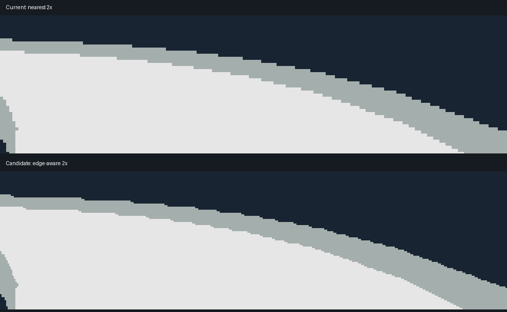

# 赛道台阶边缘核实与修整实验

2026-09-10，StopWatch / ESP32-S3。当前比赛小场景为 234×233，原生画布 468×466。旧路径把每个小场景像素复制成 2×2 方块；斜线、弯道与栏杆的台阶因此被放大。最近的选车与遮挡优化没有再次降低比赛分辨率。

下图来自生产 renderer 的同一固定姿态，局部按最近邻放大 3 倍以便观察。上为旧放大，下为新边缘修整；不是设备摄影或真人运动观感测量。

另有 [车型 3 场景对照](comparison-3.png)、[原生大小旧画面](car-0-nearest.png) 和 [原生大小修整画面](car-0-filtered.png)。

## 方法和边界

采用 [Scale2x 的相邻像素一致性规则](https://www.scale2x.it/algorithm)：放大时按上下左右的颜色关系修整局部边角，边界重复最近像素。只复制已有颜色，不做全屏颜色混合；能把许多粗台阶细化，但不能恢复低分辨率中丢失的几何或细线，也不是覆盖率采样式抗锯齿。

处理位置在小场景放大阶段，因此包括赛道和已经画进小场景的远处对手。玩家及更近的对手、HUD 和小地图仍按既有顺序在原生画布绘制；几何、遮挡深度和模型材质未改。粗场景的颜色边界会改变约一个原生像素，不能把整幅画面说成无损，也不能宣称所有车道线和动态边缘完全平滑。

首版直接用 M5GFX 的 packed `swap565_t` 运行规则。目标汇编出现大量 `l8ui/s8i` 及局部像素拆装，实测成本偏高。修订版先把原存储字节复制到对齐的 uint16_t 行数据，使用三条输入行循环复用、两条输出行，结束时按原字节序复制回画布。没有交换 RGB565 颜色，也没有增加整屏缓冲。

修订版缓冲为 `(3×240 + 2×480)×2 = 3360 B`，约 3.28KiB，比赛 renderer 打开时尝试分配内部 RAM，沿用已有 32KiB 余量守卫，分配失败回退旧最近邻路径，关闭时释放。源行只顺序读取一次，边界处重复首末行。App 的正常比赛启用边缘模式，renderer 保留旧模式用于回退与对照；选车和 VIEW CAR 不使用这段放大路径。

## 设备测量

8 车型 × 2 赛道 × 13 快照 × 2 模式，每组首帧预热，其余 12 帧计时，每模式 192 帧。每个快照轮换执行顺序，使用同一 renderer 与缓存分配，包含真实同步全屏呈现。每个快照另恢复最近邻一次做 CRC 校验；每组首帧对新模式的直接行复制和显示库复制做一次 CRC 比较，均在计时外。

玩家 Medium、两名对手 Minimal，固定种子 42、速度状态 12m/s；两赛道均匀位置采样包含桥区，周期性改变一个对手的位置覆盖近裁剪。它不替代真人操纵、运动闪烁观感、音频并行或长期稳定性验收。不同实验固件不直接拼接帧耗时。

| 最终同固件对照 | 最近邻 | 对齐行边缘修整 |
| --- | ---: | ---: |
| 放大阶段平均 | 14.346ms | 20.257ms |
| 绘制平均 | 123.205ms | 130.421ms |
| 呈现平均 | 31.513ms | 31.495ms |
| 整帧平均 | 154.718ms | 161.916ms |
| 整帧 P95 | 177.757ms | 192.758ms |
| 整帧最大值 | 202.579ms | 213.836ms |

**画质换取少量速度：放大约增加 5.911ms，整帧约增加 7.198ms（4.65%）。** P95 增加 15.001ms，不能只报平均值，也不能描述为没有帧率代价。整帧变化包含其他阶段与日志波动，不恰好等于放大变化。当前启用作为可体验的画质折中，真实运动清晰度和主观流畅度尚待用户复验。

## 正确性及证据

- 新模式改变了全部 208 个已测快照的画面，符合边缘修整预期。
- 208 次恢复旧模式的 CRC 一致；16 次新模式直接复制／显示库复制 CRC 一致。这证明已测状态没有模式残留，并验证设备字节序与复制路径；不表示新旧采样图相同。
- 主机检查包含单像素／边界、色块保持、已知对角台阶、32 个实际车型姿态的新模式复制／恢复对照，以及不透明 HUD 内部像素保持。第一版 HUD 测试框误含赛道背景，修正测试区域后通过，未改变产品 HUD 来迎合测试。
- 对齐版本与 packed 首版的全部 404 张主机输出逐字节一致，其中包含 16 张新旧边缘对照；性能修订没有改变算法效果。
- 旧模式下的既有参考场景继续回归；正常 App 现在启用新模式，不能把旧模式图像一致性写成比赛新画面无变化。
- 最终实验开局内部 RAM 可用 92787 B，末尾 92779 B，PSRAM 均为 5559444 B；任务最小剩余栈 1260 B。这仅覆盖固定序列，不是十分钟或全调用链稳定性证明。

`baseline/` 保存本轮前文件；`packed-prototype/` 保存未采纳的较慢首版源码、日志和哈希；`experimental/` 保存对齐实现及临时 `edge_device_benchmark.cpp`。复现时放回同名源码，在 HAL 与 Wifi 初始化后调用临时入口，为该源设置 `-O2;-fno-builtin-memset`，重新配置构建。实验结束后必须移除临时源与调用，再构建正常固件。

执行 `python3 docs/assets/track-edge-lab/analyze.py`，从 [ab-device.log](ab-device.log) 重新生成 [frames.csv](frames.csv) 和 [summary.json](summary.json)。固件哈希见 [experiment-firmware.json](experiment-firmware.json)。所有烧录均核验 StopWatch 83401 / 303A:1001 / 44:1B:F6:C1:8A:00，仅写 0x20000 应用分区；PaperColor 83301 不参与。

## 正常固件交付

已移除临时基准入口并完成正常构建、完整 ASan/UBSan 回归。正常 App 启用边缘修整。仅向核验后的 StopWatch 应用分区烧录，设备写入哈希验证通过，启动日志确认 ELF `154f661b5…` 与 Launcher 打开。BIN SHA256 为 `8f44b51ac8e4889f5f2b2b0d4967059687fe4f35d26e4ec7c03b502a05d7b0ba`。见 [交付记录](delivery.json)、[烧录日志](final-flash.log)、[启动日志](final-device.log) 与 [完整主机测试](final-host-tests.log)。正常启动确认不替代真人比赛画质和操纵体验验收。
