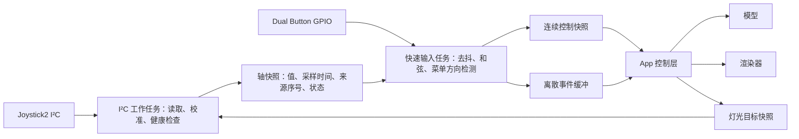

# 外设输入接入与故障排查规范

> 日期：2026-09-09。适用：StopWatch 上接入 Joystick2、Dual Button 或类似外设的新 App，以及 Launcher、Racer、Vector Run 的输入维护。
>
> 代码审查基线：`4d2d477`（原提交 `201b7f9`），对照修复前 `8c47448`。本文记录代码事实、整改方案与验收要求；不代表已完成下述整改或真机验收。硬件接线沿用 [科技游戏外设接线设计](科技游戏外设接线设计.md)。

## 2026-09-09 R26 实施更新

以下正文保留 `4d2d477` 的审查基线，不能把其中“未解决”直接当作最新状态。R26 已实现 RGB 后台提交、轴错误状态一致性、菜单短拨事件、切页回中门禁、暂停恢复有效性检查，以及独立机身按键/触屏操作。实现、测试、固件与实测状态以 [R26 机身操作与性能优化](Lets-And-Go-Racer-R26-机身操作与性能优化.md) 为准。

机身与菜单逻辑、整体主机回归及目标构建已通过，设备已烧录并采集首轮性能日志。外设总线超时注入、真实 Joystick2/Dual Button、电源失败清理和长期重入验收仍需后续完成；不要把后台化等同于全部故障场景已经实测。

## R27 触屏实施更新

Racer 菜单已改为共享控件边界、松手确认、滑出取消及首帧显示完成后的释放门禁；比赛转向仍实时消费连续坐标。触屏点击日志在主线程输出，不占用 GPIO/快照互斥锁。HAL `TouchPoint.valid` 区分读取失败与真实释放，`num` 同时尊重 CST820 的 Down/Contact/Up 状态；Racer 读取失败取消当前手势，不刷新成功采样时间。其他调用者仍可使用原 num/x/y，但新接入应显式检查 valid，避免把总线错误当成松手。

不要用显示控制器的显存 offset 直接推断触屏坐标补偿。先记录目标位置、按下与最后有效接触坐标、命中目标和动作，再判断是热区、页面时序、读失败还是实际坐标映射问题。本轮没有施加未经测量的坐标平移或缩放。实施、测试与真机反馈见 [R27 UI 记录](Lets-And-Go-Racer-R27-交互与UI优化计划.md)。

## 1. 新 App 先完成什么

R27 后续兼容性检查将同样的显示/释放门禁补到外设 Provider，并修复自动校准转页消费旧确认、切页丢失全局退出的问题。新 App 需要同时防止“队列中已有的旧事件”和“旧按住手势在新页才释放”两类残留；清空队列不能代替释放门禁。普通切页保留退出，关闭/重入才完全重置；同一导航模式的不同页面也要更新上下文。实现与验证边界见 [R27 外设交互兼容性检查](Lets-And-Go-Racer-R27-外设交互兼容性检查.md)。

在绘制复杂场景前，先用简单输入诊断页跑通以下流程：

1. 获取外设资源、开启供电、等待稳定，然后启动设备探测。
2. 显示真实连接、校准和故障状态；摇杆轴与按键分别报告健康状态。
3. 独立采集输入；I²C、灯光、日志和渲染均不能拖住 GPIO 按键采样。
4. 连续控制消费最新有效轴；菜单方向和点击按事件消费，慢帧不能吞掉完整操作。
5. 失联输出中性控制，保留返回/退出；恢复后经过明确的就绪流程。
6. 跑通本文验收矩阵，再接入正式画面、音效与玩法。

输入接入必须同时证明“设备读到了”和“操作被 App 消费了”。复用现有驱动后仍需核对供电、时钟、任务、状态机和生命周期，不能只复制 `Provider` 的构造语句。

## 2. Racer 这次暴露了什么

本次没有新增真机采集，因此下表不把所有机制都认定为昨天现场故障的唯一原因。已修复项可以从提交差异确认；待加固项来自当前调用链审查。

| 机制与可见症状 | 代码证据 | `4d2d477` 后状态 |
| --- | --- | --- |
| 进入 Racer 后摇杆不响应，其他 App 可用 | 原 `onOpen()` 未开启 Grove 5V；Vector Run 在打开输入前已执行供电与等待 | Racer 补上 `setGrove5VPower(true)` 和 20ms 等待；Launcher 补上等待。电源调用失败的处理仍需完善 |
| 收到数据却被判断为过期/失联 | 原轴任务用 FreeRTOS tick 时间，App 用 `Hal::millis()`；调用者先取时间、后台后发布更新，也可能导致无符号差值下溢 | 统一到 `esp_timer_get_time()/1000`；新鲜度判断先读样本时间再读取当前时间 |
| 复杂画面下红蓝键短按没反应，校准变慢 | 原动作采样、轴快照消费及校准累计依赖 App 帧率；渲染期间可能完成一次按下和释放 | 新增 10ms 输入任务，缓存点击/暂停/退出边沿；快任务消费轴快照，加快收集独立校准样本 |
| 摇杆校准/失效时，有效红蓝键也失效 | 原映射因轴无效提前返回，连独立按键动作一起丢弃 | 保留有效动作来源的按键；赛车物理仍以 `valid` 决定中性控制 |
| 总线异常时仍丢短按、UI 卡住 | `poll()` 持有 `_mutex`，先调用 `sampleAxes()`；后者同步执行 `updateRgbFeedback()` → I²C 写入，之后才采 GPIO | **未解决**。当前 `CONFIG_I2C_MS_TO_WAIT=200`，总线等待可能跨过完整短按；主线程读取同一把锁也会等待 |
| 慢帧中短拨摇杆回中，菜单没有移动 | `RacerInputMailbox` 只锁存按键边沿，轴始终被最新值覆盖；`GarageMenuNavigation` / `MenuAxisRepeater` 仍在 App 帧中运行 | **未解决**。后台读到偏转不等于菜单消费到偏转；若偏转被判为有效后又回中，方向意图仍可能被覆盖 |

退出残音也在该提交中修复：HAL 增加 I²S 自动清零和流结束静音写入。它属于音频生命周期，不是摇杆有效性的判断依据。

### 历史记录怎么读

[R5 控制与动力学评审](Lets-And-Go-Racer-R5-控制与动力学评审.md) 和 [G4-P4 外设驱动静态评审](Vector-Canyon-Fighter-G4-P4-外设驱动静态评审.md) 是阶段记录。其中“已验证驱动”“I²C 不阻塞 UI”等描述不能直接用作当前版本的完整验收结论：后续加入的 RGB 写入也必须沿调用链检查。主机纯逻辑测试不覆盖供电、真实 I²C、FreeRTOS 调度和实际渲染延迟。

## 3. 硬件与时序基线

以下是本仓库当前配置，移植其他设备时重新核对，不把项目值当作通用硬件保证。

| 项目 | 当前实现/配置 | 接入要求 |
| --- | --- | --- |
| 外设电源 | `Hal::setGrove5VPower()` 调用 PMIC `setBoostEnable()` | 每次进入均明确管理供电；检查返回值，失败显示电源故障，不能进入 Ready |
| 上电等待 | Racer / Vector Run / Launcher 使用 20ms | 作为当前启动基线；真实稳定时间需硬件验证，禁止用固定等待代替设备探测 |
| Joystick2 | I²C1，SDA GPIO10，SCL GPIO11，100kHz，地址 `0x63` | 复用驱动；不要在多个 App 中重复维护寄存器和总线配置 |
| 协议 | `0xFE` 身份探测，`0x50` 小端有符号 XY，`0x20` 摇杆按键，`0x30` RGB | 见 `external_input_logic.h` 与 `joystick2_axis_source.cpp` |
| Dual Button | 红 GPIO3、蓝 GPIO4；上拉、低有效 | 线束约束见接线文档；GPIO 配置成功不能证明被动按钮实体已连接 |
| 轴硬件读取 | 20ms / 50Hz | 新鲜度使用成功采样时刻，不能用 App 消费时刻伪装数据更新 |
| Racer 动作采样 | 10ms / 100Hz；任务创建失败回退逐帧轮询 | 回退必须报告降级；不能宣称仍保证慢帧短按不丢 |
| 去抖 / 长按 / Racer 退出和弦 | 20ms / 500ms / 800ms | 固定时间语义，不按帧计数；长按释放不再补发短按 |
| 校准 | 至少 700ms、20 个独立样本；XY 行程各不超过 180 counts | 必须同时满足时间、独立样本数和稳定性；同一快照重复读取不计新样本 |
| 轴失效 | 样本超过 300ms，或连续错误达到 3 次 | 立即失效并清零连续操纵量；故障、有效性和 UI 使用一致判据 |
| Racer 失效处理 | 物理层中性转向/无增压/刹车；App 观察到持续无效 600ms 后暂停 | 600ms 是 App 观察窗口，不是从拔线起算的端到端保证，还存在检测与帧调度时间 |
| RGB / I²C 等待 | RGB 最多每 80ms 尝试；I²C 配置等待 200ms | 限频只减少调用次数，不能消除单次阻塞；读写和总线锁等待均应计时 |

### 统一时钟与一致快照

统一用一个单调毫秒时钟封装，当前项目实现为 `uint32_t(esp_timer_get_time()/1000)`。FreeRTOS tick 仅用于任务调度；不要把两种时间直接相减。

发布轴值、有效样本时间、来源序号和健康状态时保持一致快照。读取顺序如下（设计示意，不是现成 API）：

```cpp
const auto snapshot = readPublishedSnapshot();
const uint32_t nowMs = monotonicMillis();
const uint32_t ageMs = nowMs - snapshot.lastValidSampleMs;
const bool fresh = snapshot.hasSample && ageMs <= staleAfterMs;
```

这样避免“先取 now、后台发布更新、再取 lastValid”导致时间看似来自未来。用无符号差值处理毫秒回绕；显式记录是否有样本，测试零时刻和回绕边界。来源读取序号应与 App 消费序号区分，否则 `seq` 增长只能证明函数在运行。

## 4. 推荐输入结构

下面是新 App 的目标结构，当前仓库尚未提供完全符合该结构的公共服务。



### 4.1 阻塞工作与快速输入隔离

- I²C 工作任务拥有探测、读取、RGB 写入和设备关闭；读操作优先，RGB 合并为最新目标、限频发送。出现错误时停止非必要灯光更新，探测重试使用有界退避。
- GPIO 去抖、按键和弦与菜单方向检测在独立快任务执行。它只能读取内存轴快照，不调用 I²C，也不等待持有总线操作的锁。
- 互斥锁只覆盖定长快照复制或事件交换；锁内不能执行总线、日志、音频、显示和延时。必要的设备配置通过命令交给拥有设备的任务。
- App 每次更新只取快照/事件。使用测量记录 `sample()`、最大 GPIO 采样间隔和总线耗时，不能因为“开了后台任务”就认定解耦完成。
- 发生超时后避免 `vTaskDelayUntil()` 长时间密集追赶过期节拍；检查当前节拍配置，保证周期转换不为零，并记录超期次数。
- 保留当前驱动协议实现，逐步把公共外设服务移出具体游戏目录。迁移前可复用 Vector Run 的底层类，但不得连同帧轮询和 RGB 同步调用方式原样复制。

### 4.2 连续量与离散意图使用不同缓冲规则

| 数据 | 消费方式 | 原因 |
| --- | --- | --- |
| 比赛转向、持续刹车/增压 | 最新快照；失效时中性化 | 不能在下一帧重放几百毫秒前的极端转向或已释放的增压 |
| 确认、取消、暂停、退出 | 锁存至消费，单次交付 | 100ms 操作可能完整发生在 400ms 渲染期间 |
| 菜单摇杆短拨 | 快任务检测阈值/回中，形成方向事件 | 只保留最新轴会丢掉已经回中的有效短拨 |
| 菜单长拨 | 时间驱动连发；过期连发合并并限制消费数量 | 慢帧恢复后不能一次连跳大量选项 |
| 校准样本 | 来源序号去重后累计 | 快任务读取频率高于硬件采样频率时不能重复计数 |

当前 `RacerInputMailbox` 用布尔 OR 合并同类边沿，能够保留“一次发生”，不能表达多次点击的次数和先后顺序。新 App 先声明是否允许合并；需要逐次操作的界面使用定长事件队列，定义容量、溢出计数和处理策略。退出必须优先且不被队列溢出挤掉。

菜单事件绑定输入上下文/代次；切页、重校准、关闭和重新打开时清理旧事件。握住方向跨页时要求回中后重新触发，避免上一页积累的方向/确认自动作用于下一页。双键退出独占同次手势，不能同时暂停、确认或增压。

### 4.3 健康状态与恢复路径

- 分别维护轴有效性、动作源有效性和采样任务健康。轴失效不屏蔽来自有效动作源的返回、取消、退出；不可让无效来源伪造动作。
- `Ready` 必须满足身份成立、已校准、数据新鲜、错误未超阈值。当前 `axisStatus()` 的 fresh/已校准分支未统一应用 3 次错误阈值，而 `sampleAxes()` 应用了该阈值；整改时让状态和输入使用同一健康快照。
- Racer 保留中性转向、无增压和安全减速；输入丢失后进入暂停。恢复到 Ready 后由用户明确继续，不能在摇杆仍失效时长按红键直接恢复比赛。当前恢复分支还没有这一就绪门禁，列入待整改项。
- 检查页和校准页显示真实状态。无数据时显示失联/探测失败，不能只显示不断增长的校准进度；静止校准失败可重试并一直保留机身退出路径。
- 后台任务创建失败、异常停止或长期未发布数据时，明确显示降级/故障。逐帧轮询可作为功能回退，但不满足本规范的输入延迟验收。

### 4.4 生命周期与资源所有权

进入顺序：确认上一页面已释放外设 → 开启电源并检查结果 → 等待稳定 → 打开驱动 → 启动采样 → 探测/校准 → Ready。

退出顺序：停止接收新业务操作 → 停止并等待输入任务不再访问对象 → 由设备拥有者完成有限时的关闭 → 释放设备/GPIO/总线 → 清空快照、按键状态和菜单事件 → 释放电源 → 恢复 Launcher。Racer 的音频、振动和渲染资源也必须完成各自清理。

任务结束确认后才销毁对象和 mutex；关闭失败也不能释放仍被任务使用的内存。所有等待必须有设计上限及故障处理，不能强删任务后假定总线锁已经释放。`open/close`、部分初始化失败后的清理均应可重复调用。

Launcher、Racer、Vector Run 目前各自管理电源和 Provider。新 App 必须验证实际页面切换时只有一个活跃所有者；若未来允许同时使用，应先提供公共租约/引用计数，再允许共享，不能任意关闭其他使用者的 5V。

## 5. Racer 的整改顺序

本节是待执行工作，不随文档落地自动标记为完成。

| 顺序 | 修改位置与具体工作 | 完成证据 |
| --- | --- | --- |
| 1 | `Joystick2AxisSource` 把 RGB 写入移入 I²C 工作任务；`HardwareRacerInputProvider` 只读内存并采 GPIO，缩小共享锁范围 | 注入 200ms 总线超时期间，完整 100ms 红/蓝短按仍交付一次；App 快照读取不随总线一起等待 |
| 2 | 在快任务中识别菜单 X/Y 方向事件，保留现有主轴锁定/滞回；App 消费事件并在切页时更新上下文 | 400ms 慢帧内有效短拨并回中仍切换一次；持续比赛转向仍只用最新值 |
| 3 | 统一轴健康快照；检查电源/任务创建失败；输入失联后恢复需要 Ready 和用户动作 | 连续 3 次错误时状态/操纵量一致失效；失联长按红键不能恢复比赛 |
| 4 | 增加生产 Provider 的故障注入测试与阶段诊断 | 覆盖真实调用顺序、互斥、延迟、关闭和重入；不能仅重复测试纯映射函数 |
| 5 | 执行固件构建和真机完整流程，记录实测延迟与剩余问题 | 本文验收表逐项有结果、日志路径、固件版本和硬件配置 |

若需要先缩小排障范围，可以临时关闭 RGB，使用轻量诊断页验证输入链路；这属于定位手段，不能用来证明带完整画面和音效的正式 App 已通过。

## 6. 快速排障：在哪一层断了

按“电源 → 设备 → 数据 → 有效性 → 事件 → 页面消费”的顺序排查，不先盲调死区、灵敏度或延时。

| 现象 | 首先检查 | 定位依据 |
| --- | --- | --- |
| 一个 App 可控，另一个不可控 | 各自供电、打开/关闭顺序、任务启动 | 同一硬件可用时，优先比较完整接入流程 |
| 没有身份响应 | 5V 开启结果、地址/端口、I²C 返回码 | 区分电源失败、总线失败和设备探测失败 |
| 来源序号增长但 `valid=false` | 样本年龄、时钟、校准样本数、连续错误 | 不能只看一个 `connected` 布尔量 |
| `valid=true` 且 XY 变化，但菜单不动 | 方向阈值、主轴锁、事件生成/消费、当前 screen | 区分轴过滤与回中前未消费的方向意图 |
| 红蓝键短按偶发不生效 | GPIO 最大采样间隔、RGB 写入、锁等待、渲染时间 | 先证明 raw 按下/释放被采到，再检查事件映射 |
| 一次点击跳两页、长按退出触发暂停 | 边沿是否重复消费、事件是否跨页、和弦优先级 | 追踪同一事件 ID/上下文，不能只记录按钮最终状态 |
| 校准一直不结束 | 独立样本数、噪声/行程、任务是否被阻塞 | 700ms 是最低观察时长，不是无条件完成计时器 |
| 退出后再次进入失效 | 残留任务、旧事件、电源归属、总线/GPIO 清理 | 测 Launcher → App → Launcher → 另一 App 的完整链路 |

当前 `RacerInput` 日志已有 `seq/axis/ready/errors/x/y/buttons/red/blue`、点击/退出日志，App 也记录状态转移。这里的 `seq` 是输入发布次数，`ready` 日志字段是 readiness 枚举值；不能据此单独证明真实轴数据持续更新。

下一轮诊断补充：轴来源序号、`sampleAgeMs`、独立校准样本数/跨度、最大 GPIO 间隔、I²C 读写耗时、锁等待、事件产生/消费/溢出计数、最大渲染耗时、任务启动失败与退出耗时。常态限频，异常和状态切换即时记录；高频采样内只更新计数，不同步输出大量日志。

## 7. 接入验收矩阵

下列数值是新接入的初始验收目标，不是当前固件已经达到的实测指标。改变目标时在该 App 的记录中解释原因。

| 场景 | 操作/注入 | 通过条件 | 当前证据 |
| --- | --- | --- | --- |
| 基础按钮 | 红/蓝各一次 100ms 点击，长按、释放、双键 800ms | 单次消费，长按释放无短按，退出独占 | 当前输入主机测试覆盖主要映射 |
| 慢帧按钮 | 消费端暂停 400ms，期间完整按下并释放 | 两键分别不丢、不重放，持续量回到最新状态 | `validateSlowFrameInput()` 已覆盖纯逻辑 |
| 慢帧菜单摇杆 | 400ms 停顿内，规范化轴越过阈值并稳定 100ms 后回中 | X/Y 各触发一次；正常持续转向无历史回放 | 待实现方向事件及验证 |
| 总线超时 | Fake 总线连续制造 200ms 等待，同时发送按钮点击 | 快照读取目标 ≤5ms，GPIO 最大间隔目标 ≤20ms，100ms 点击不丢 | 待生产适配层故障注入与真机测量 |
| 陈旧/错误 | 停止成功采样超过 300ms；另测 fresh 窗口内 3 次连续错误 | 轴失效、无增压，状态一致；有效返回/退出保留 | 当前部分纯逻辑覆盖，完整驱动路径待补 |
| 时钟 | 发布发生在旧帧时间之后；零时间、`uint32_t` 回绕 | 正常样本不误判过期，真过期样本不被刷新消费时间掩盖 | 待轴驱动时钟注入测试 |
| 校准 | 静止、移动、重复序号、无样本 | 时间/样本数/稳定性同时达标才 Ready；无数据不能完成 | 生产校准注入测试及硬件测量待补 |
| 故障恢复 | 模拟失联后恢复新鲜数据，在恢复前后尝试继续 | 失效期间无法恢复比赛；就绪后明确继续，无旧动作 | 待补恢复门禁 |
| 资源失败 | 电源调用、设备创建、任务创建分别失败 | 有诊断和退出路径，清理可重复，无伪 Ready | 待注入测试 |
| 重入与跨 App | Launcher → Racer → Launcher → Vector Run 循环至少 20 次 | 无残留任务/事件/总线占用，按键与供电每次正常，退出无残音 | 待真机 |
| 完整画面 | 最高负载车库和比赛，音乐开启，至少运行 10 分钟 | 连续操作无漏控，记录输入延迟、错误计数、任务栈与帧耗时 | 待真机 |

总线失联优先使用软件故障注入。真实线束操作遵循接线文档的断电要求；不要为完成软件验收随意带电拔插。

验证分三层记录：主机逻辑/故障注入通过、ESP-IDF 目标构建通过、硬件与交互实测通过。只有三层证据齐全才写“外设输入接入完成”；未测项写待验证。

### 可复跑的现有检查

从仓库根目录执行，输出放到临时目录，不触碰固件和设备：

```bash
review_out="$(mktemp -d "${TMPDIR:-/tmp}/stopwatch-input-check.XXXXXX")"
for suite in lets_and_go_input vector_canyon_external_input launcher_external_input; do
    c++ -std=c++17 -Wall -Wextra -Werror -pedantic \
        "tools/${suite}_test.cpp" -o "$review_out/$suite" || exit 1
    "$review_out/$suite" || exit 1
done
```

本次审查在 `4d2d477` 输入代码上运行以上 3 组测试及 `lets_and_go_audio_lifecycle_test.cpp`，全部通过。音频测试涵盖并发生命周期，但不涵盖真实 HAL/I²S 静音效果。本次未构建固件、未烧录、未执行真机输入验收。

后续修改共用输入驱动时，在上述检查之外运行 `bash tools/test_lets_and_go.sh` 覆盖 Racer、Vector Run、Launcher，配置好本地 ESP-IDF 环境后执行 `idf.py build`。测试清单以脚本实际内容为准，不依赖历史文档中的套数。

### 新 App 验收记录模板

```text
App / 提交 / 固件：
设备、外设型号与接线文档版本：
轴来源 / 动作来源 / 供电所有者：
菜单方向、点击合并策略 / 持续控制 / 退出映射：
任务周期 / I²C 超时 / 失联及恢复策略：
主机逻辑与故障注入命令、结果、日志路径：
目标构建结果：
真机慢帧、总线异常、重入、完整画面结果：
最大采样间隔 / 输入消费耗时 / 样本年龄 / 事件丢失与溢出数：
未通过项 / 下一步 / 验收人及日期：
```

## 8. 代码与资料入口

- [Racer 输入适配器](../main/apps/app_lets_and_go_racer/input/hardware_racer_input_provider.cpp)：任务、锁、GPIO/轴组合与关闭。
- [Racer 输入逻辑](../main/apps/app_lets_and_go_racer/input/racer_input_logic.h)：映射、按键邮箱、菜单方向和长按退出。
- [Racer App](../main/apps/app_lets_and_go_racer/app_lets_and_go_racer.cpp)：电源、检查/校准、页面消费、失联暂停和退出。
- [Racer 动力学](../main/apps/app_lets_and_go_racer/model/racer_model.cpp)：输入无效时的中性控制。
- [Joystick2 轴源](../main/apps/app_vector_canyon_fighter/input/joystick2_axis_source.cpp)、[Dual Button 动作源](../main/apps/app_vector_canyon_fighter/input/dual_button_action_source.cpp)：当前共享使用的硬件实现。
- [外设纯逻辑](../main/apps/app_vector_canyon_fighter/input/external_input_logic.h)、[动作语义](../main/apps/app_vector_canyon_fighter/input/flight_input.h)：协议常量、去抖与动作映射。
- [Vector Run App](../main/apps/app_vector_canyon_fighter/app_vector_canyon_fighter.cpp)、[组合层](../main/apps/app_vector_canyon_fighter/input/composite_input_provider.cpp)、[Launcher](../main/apps/app_launcher/view/view.cpp)：其他消费者，修改共享驱动时必须一并回归。
- [HAL 时钟](../main/hal/hal.cpp)、[HAL 电源](../main/hal/hal_pmic.cpp)、[HAL 音频](../main/hal/hal_audio.cpp)：全局硬件服务。
- [Racer 输入测试](../tools/lets_and_go_input_test.cpp)、[整体回归入口](../tools/test_lets_and_go.sh)。

维护本文时同步更新代码基线、当前已实现状态和测试证据。原理与验收要求保持统一入口，具体 App 只记录动作映射、参数差异和实测结果。
